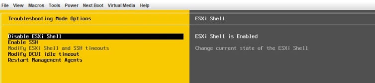

# VxRail Manager Initialization

- Table of Contents
{:toc}

# Changelog
  
| Version | Date       | Description              | Author       |
| ------- | ---------- | ------------------------ | --------------- |
| 0.1     | 28/12/2021 | First version | Rohit Singh |

# Introduction

## Purpose

The purpose of this document is to describe steps that should be performed to initialize VxRail Manager.

## Scope

The scope of this document covers the following:

1. VxRail Manager initial configuration

## Imaging/Resetting to factory settings the VxRail nodes

If it's not already done, all VxRail hosts have to be imaging or resetting to factory settings by using Dell EMC RASR (Rapid Appliance Self Recovery) process.
This procedure is covered by chapter 'VxRail 4.7 Nodes' in [DPC.Next ESXi Refreshing procedure](https://msdevopsconfluence.fsc.atos-services.net/confluence/pages/viewpage.action?spaceKey=DPC&title=DPC.Next+ESXi+refreshing).

## VxRail Manager initializing procedure

1. When all VxRail nodes are already reset to factory settings (procedure described in chapter 'VxRail 4.7 Nodes' in [DPC.Next ESXi Refreshing procedure](https://msdevopsconfluence.fsc.atos-services.net/confluence/pages/viewpage.action?spaceKey=DPC&title=DPC.Next+ESXi+refreshing).), open iDRAC console on the first host of the new VxRail cluster;
2. In DCUI press F2 and provide ESXI root credentials when prompted (default root's password is 'Passw0rd!'). Enter 'Troubleshooting Options' and Enable the ESXi Shell. Press alt+F1 to switch to prompt.

3. List and set MGMT VLAN Id for 'Management Network', 'VM Network' and VxRail Discovery vLAN Id for 'Private Management Network', 'Private VM Network' typing below commands one by one using proper VLAN Id for both MGMT VLAN Id and VxRail Discovery vLAN Id:

 ```bash
  esxcli network vswitch standard portgroup list

  esxcli network vswitch standard portgroup set –p "Management Network" –v "2800"
  
  esxcli network vswitch standard portgroup set –p "VM Network" –v "2800"
  
  esxcli network vswitch standard portgroup set –p "Private Management Network" –v "2899"
  
  esxcli network vswitch standard portgroup set –p "Private VM Network" –v "2899"
```


4. Set the VxRail Manager VM IP typing below command (replace IP address, netmask and gateway with proper ones):

```bash
  vxrail-primary --setup --vxrail-address 172.22.128.14 --vxrail-netmask 255.255.255.0 --vxrail-gateway 172.22.128.1 --no-roll-back --verbose
```

5. When VxRail Manager has been deployed successfully, it has to be restarted. First list all vms and note 'vmid' for VxRail Manager:

```bash
  vim-cmd vmsvc/getallvms
```


6. Run command to check vm state, replacing 'vmid' with proper one :

```bash
  vim-cmd vmsvc/power.getstate 'vmid'
```

7. Restart VxRail Manager vm:

```bash
  vim-cmd vmsvc/getallvms
  
  vim-cmd vmsvc/power.shutdown "1"
  
  vim-cmd vmsvc/power.getstate "1"
  
  vim-cmd vmsvc/power.on "1"
  
  vim-cmd vmsvc/power.getstate "1"
```
