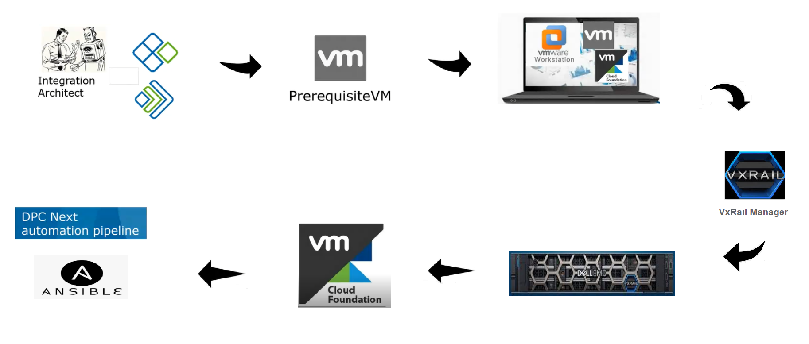
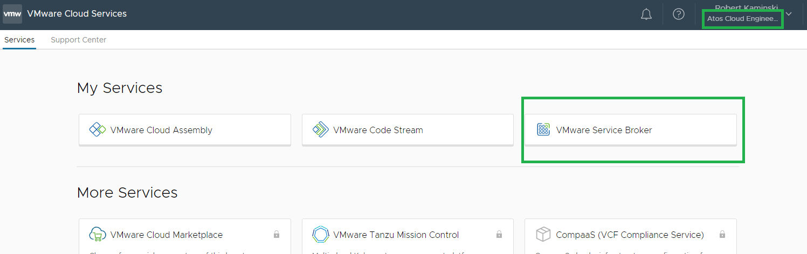
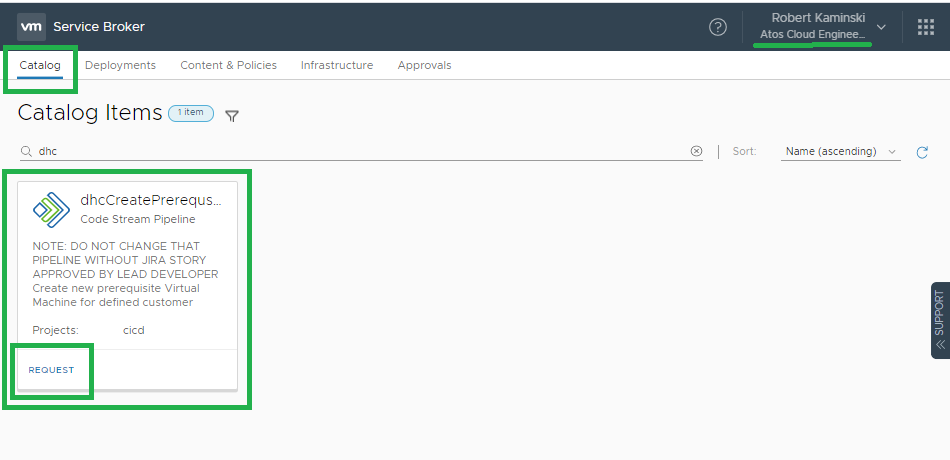
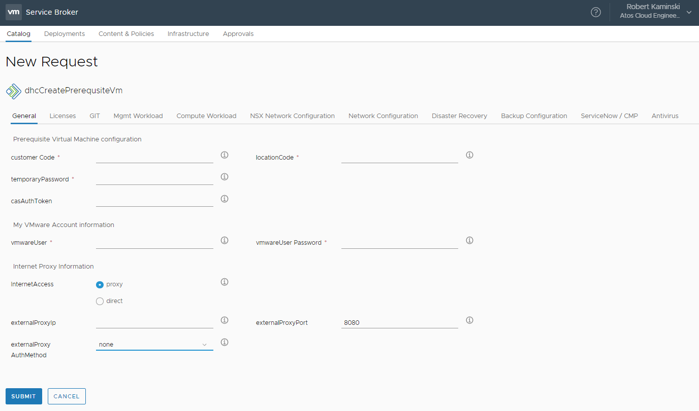
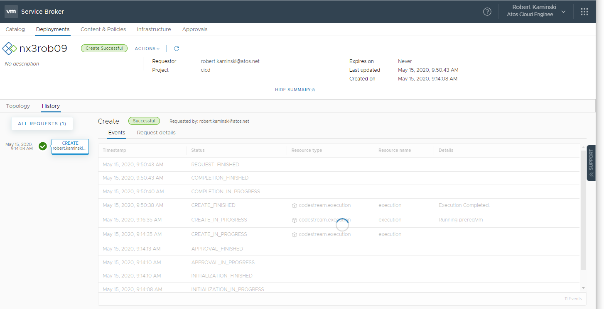
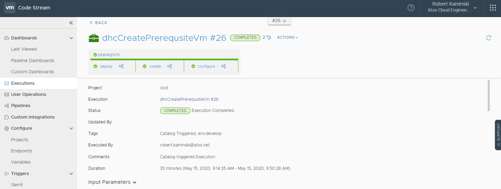
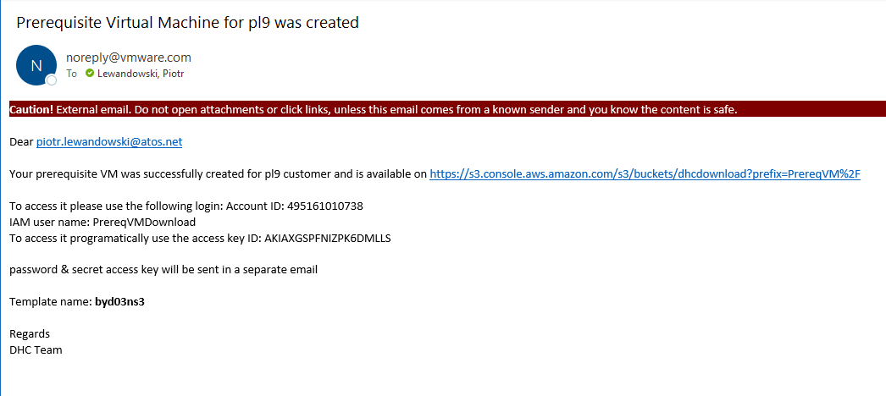
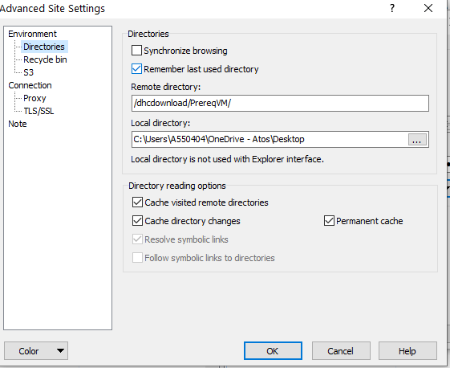
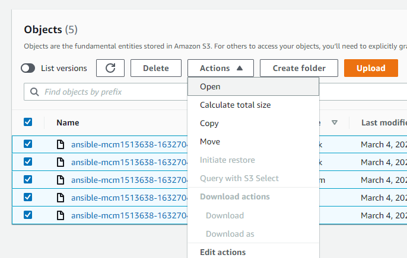

# DHC on VxRail Build Guide

- Table of Contents
{:toc}

# Changelog

| Version | Date       | Description              | Author       |
| ------- | ---------- | ------------------------ | --------------- |
| 0.1     | 24.12.2021 | Initial draft | Arun Sompura |
| 0.2 | 28.12.2021 | Updates and tidy-up | Vishnu Panchal|

# Introduction

This document provides step-by-step procedure for deploying a DHC on VxRail. Target audience is DHC Devops team, deployment engineers, integration architect and all people who wants to know or involved in DHC on VxRail deployment  procedure. It is assumed that the reader has reasonable understanding of DellEMC VxRail platform & DHC architecture and design.

# Software Repository

The following resource repositories store ansible scripts (playbooks, and roles), documentation and binaries required for DHC deployment and DHC on VxRail deployment. Their content is retrieved automatically during the DHC deployment.

| Resource repository | URI| Comment|
| ------ | ------ | ------ |
| Amazon S3 |  | software and images available from Code Stream pipe line when creating PrerequisiteVM|
| DHC on VxRail Github Repository | [https://github.com/ | Update correct repo once available | valid |


# DHC on VxRail build steps overview



# DHC on VxRail build preparation

1. Integration Architect gathers details of VxRail hardware, network, backup integration, antivirus integration, service now integration etc. Integration architect should also verify DC LAN design with NDCS (for supportability) and against DHC requirements (for compliance) at this stage.
2. Integration Architect creates service account in Atos and VMware systems.
3. Integration Architect executes creation of prerequisite VM task on VMware Console. The Prerequisite VM is required during the VxRail BringUp, SDDC Bring UP, vCF on VxRail BringUp as it provides initial DNS, DHCP, NTP services as well as orchestrates non-VCF components build up. 
4. Integration architect shares prerequisite VM OVA with deployment team.
5. Deployment team downloads prerequisite VM OVA, CloudBuilder OVA to be downloaded and stored on prerequisite VM binaries location. The prerequisite VM OVA is imported to workstation. 
6. Deployment team connects laptop with VMware Workstation that runs prereqVM to DHC switches (management network).
7. Verify VxRail nodes are racked, nodes powered ON. Cabling and network configuraiton done. Nodes should be accessible over iDRAC.
8. Download VxRail 7.0.241 code from DellEMC.
9. Upgrade the RASR image on the node using ISO, Install the Dell Upgrade Packages (DUPs) from SD and Factory Reset from SD.
10. Run commands for VxRail manager initialization for management cluster.


# VMware service account

1.	Create shared email account ({ customerCode}-VMware-Communication) in @atos.net domain.<br>
-Open Atos Service Portal - PISA<br>
-go to IT -> Communications and Email -> Email Mailbox -> Order DAS functional mailbox<br>
<br>
-Click Submit<br>
-Account creation shouldn't take more than 24h<br>
-After creation of email account open PISA Portal once again<br>
-go to IT -> Communications and Email -> Email Mailbox -> Manage mailbox permissions (bulk addition/removal)<br>
-Complete and attach "BulkPermission Template" with the all account that should have permissions to the newly created shared mail account (i.e members of the Ops Team that will provide support for the particular DHC customer)<br>
2.	Create a myVMware account:<br>
-Open https://my.vmware.com/<br>
-Select “Register”<br>
-Enter xxx@atos.net account as the account’s email address<br>
 <br>
-Make sure to select VMware partner YES and Organization.<br>
 <br>
-Note down the password<br>
-Click Sign-Up<br>
3.	Wait for registration email message that will be sent to xxx@atos.net email account from donotreply@vmware.com.<br>
 <br>
-Use the link provided to activate the account.<br>
4.	Contact contract-administration@atos.net and request new account to be assigned software download rights. <br>

# DELL EMC service account

1.	Create a Dell account and use the same account name and email used for VMware service account:<br>
-Open https://www.dell.com/Identity/global/LoginOrRegister/ <br>
-Enter xxx@atos.net account as the account’s email address<br>
2.	Login using account created in step 1 .<br>
 <br>
4.	Access vxrail link for planning guide, deployment overview and more resources. Note: This step is just for information as VxRail bringup is automated in DHC using Ansible.
- Open https://vxrailch.dellemc.com/home. <br>
 <br>


## Naming Convention

All the input data must be aligned with the latest approved [naming convention](../design/namingConvention.md).

**IMPORTANT**

Especially pay attention to domain name which is concatenation of variables and hardcoded string values.  
DHC domain name is equal to:  `< customerCode >dhc< dhcInstance >.next`, i.e. `nx3dhc01.next` or `nx1dhc01.next` or `nx8dhc01.next`.

## Infrastructure Requirements

Following documents describes components that are not directly managed and created by DHC, and are required for correct build process.

- [Network](../design/lldSoftwareDefinedNetworks.md#underlay-requirements-for-dhc-sdn)
- [VSAN Witness](dhcVsanWitnessAppliance.md)

### Network Infrastructure

For TOP process, it is required that there are checks perforamed installation of DHC on VxRail to ensure that the network design is compliant with both DHC on VxRail design and NDCS supportability.
It is broken in to three parts.

1. Validation with DHC on VxRail requirements and NDCS requirements at design stage
2. Validation with NDCS at implementation time that assumptions are correct and design is valid in real world.
3. Post install check against design and configuration to ensure network is deployed as expected by DHC and NDCS.

## List of input parameters for Prerequisite VM

The Prerequisite VM is required during the VxRail bring up, SDDC Bring UP as it provides initial DNS, DHCP, NTP services as well as it orchestrates non-VCF components build up.  
The Prerequisite VM is generated with each DHC deployment.  The parameters below are only a sample values, but it's a good starting point for Integration Architect what kind of data have to be gathered.

### General inputs

| Input  Parameters  |   example  for  DEV  nx1  env  | Description |
| ------ | ------ | ------ |
| customerCode  |   nx1  | Naming convention 3 Alpha , used as prefix for management domain creation |
| locationCode  |   gre02  | Location code variable represented by 3 letters and 2 digits |
| dhcInstance | 01 | DHC instance number represented by 2 digits starting from 01. Number indicates DHC instance |
| temporaryPassword | | Password used for initial deployment of all components including components of VxRail |
| vraCloudDefaultOrganization | CAS Atos | vRA Cloud Organization. The name will be used to generate authentication token|
| vmwareUser  |   VMware service account  user name  |   VMware service account  user  name  used  for  bundles  downloading  and  other  VMware  integration  like  CAS  token. For Cloud Assembly token generation it is required that vRA Cloud user has Member and Support user roles assigned. VMware service account can be requested as described in “VMware service account” chapter in this document |
| vmwareUserPassword  |   VMware service account user password  |   VMware service account password  used  for  bundles  downloading  and  other  VMware  integration  like  CAS  token |
| ntpServer1 | 10.99.94.144 | IP address of external to DHC NTP Server, provided by DC as described in DC Physical Requirements section of SDN LLD, this value is mandatory|
| ntpServer2 | 10.99.94.145 | IP address of external to DHC NTP Server, provided by DC as described in DC Physical Requirements section of SDN LLD, if only one IP address was provided, leave this field empty |
| InternetAccess  |   proxy  |   [direct/proxy] Access to internet from DHC. <BR> proxy  -  (default)  -  proxy  value  indicates  that  DPC  Web-Proxy  will  use  another  Proxy  as  parent  proxy  to  forward  traffic,  proxy  will  be  configured  under  /etc/squid/squid.conf  cache_peer  section <BR> direct  -  value  indicates  that  DPC  Web-Proxy  will  have  direct  access  to  the  Internet,  no  parent  proxy  will  be  configured  on  DPC  Proxy  under  /etc/squid/squid.conf |
| externalProxyAuthMethod  |   none  |   Parent  Proxy  authentication  method. <BR> none  -  (default  value,  Web  Proxy  for  Grenoble  Environment  does not  require authentication)  -  no  authentication  required. <br> basic  -  username/password  authentication |
| externalProxyIp  |   192.168.255.12  |   IP address of external Web Proxy Server if exist. </BR> IP  address  of  Parent  proxy  for  DPC  Proxy,  default  value  192.168.255.12  (Web  Proxy  for  Grenoble  Environment) <BR> Notice:  please  be  aware  that  in  this  version  of  Code  Stream  all  variables  need  to  be  filled,  this  mean  even  if  "direct"  access  is  chosen,  this  variable  need  to  be  filled  with  random  value ??|
| externalProxyLogin  |   test  |   username  used  by  Parent  Proxy  for  authentication,  default  value  test  (Web  Proxy  for  Grenoble  Environment  is  not  requiring  authentication)notice:  please  be  aware  that  in  this  version  of  Code  Stream  all  variables  need  to  be  filled,  this  mean  even  if  "direct"  access  is  chosen  or  "none"  for  authentication  method  is  chosen,  this  variable  need  to  be  filled  with  random  value |
| externalProxyPassword  |   test  |   password  used  by  Parent  Proxy  for  authentication,  default  value  test  (Web  Proxy  for  Grenoble  Environment  is  not  requiring  authentication)notice:  please  be  aware  that  in  this  version  of  Code  Stream  all  variables  need  to  be  filled,  this  mean  even  if  "direct"  access  is  chosen  or  "none"  for  authentication  method  is  chosen,  this  variable  need  to  be  filled  with  random  value |
| externalProxyPort  |   8080  |   TCP  port  that  Parent  Proxy  for  DPC  Proxy  will  listen  for  web  traffic,  default  value  8080  (Web  Proxy  for  Grenoble  Environment  port)notice:  please  be  aware  that  in  this  version  of  Code  Stream  all  variables  need  to  be  filled,  this  mean  even  if  "direct"  access  is  chosen,  this  variable  need  to  be  filled  with  random  value |
| networkDiscovery.vlan  |   2899  |   VXRAILDISCOVERY vLAN is used during VxRail bringup process and VxRail appliance uses this discovery vLAN |
| dellUser  |   dl-dhc-vxrail@atos.net  |   Dell service account user name used for LCM activities |
| dellUserPassword  |   Dell service account user password  |   Dell service account user password |

### Licenses

| Field description<br>*Input  Parameter name*  | example  for  DEV  nx1  env  | Description |
| ------ | ------ | ------ |
| ESXi host License Key<br>*esxiLicense* | | Provide license for ESXi hosts |
| NSX-T License Key<br>*nsxtLicense* | | Provide NSX-T license |
| vRNI License Key<br>*vrniLicense* | |Copy from NSX-T field if ENTERPRISE license key is used, otherwise provide dedicated vRealize Network Insight License Key|
| VROPS License Key<br>*vropsLicense*  | | Provide license for VMware Operation Manager <BR> i.e. VR7-OENO-C VMware vRealize Operations 7 Enterprise <br>or optionally <i> VMware vRealize Suite Enterprise license</i>|
| vRLI License Key for Compute Cluster <br>*vrliLicenseKeyForCmpCluster*  |    | Provide license for VMware Log Insight <br> i.e.VR-LIS8-OSI-C VMware vRealize Log Insight 8 <br>or optionally _VMware vRealize Suite Enterprise license_|
| Infoblox License Key<br>*infobloxLicense* |  | Provide license for infoblox |
| Compute vCenter License Key <br>*vcsComputeLicense*  | | Provide license for management vCenter |
| VSAN Compute Cluster License Key<br>*vsanComputeLicense*  |     | Provide license for compute vCenter <BR> i.e. ST6-EN-C VMware Virtual SAN 6 Enterprise|
| Remote Desktop Terminal Server License Key<br>*terminalServerLicense* | | Provide license for Remote Desktop Terminal Server |
| Nessus License | | Provide license for Nessus |

### Git

| Field description<br>*Input  Parameter name*  | example  for  DEV  nx8  env  | Description |
| ------ | ------ | ------ |
| *gitbranch* | DHC-X.X-latest | Choose the git repository as a source for code|

### Mgmt workload inputs

| Field description<br>*Input  Parameter name*  | example  for  DEV  nx1  env  | Description |
| ------ | ------ | ------ |
| *numberOfManagementHosts* | 4 | Define number of management hosts |
| *vsanEncryption* | true | [true or false] Default is true. This will install KMS appliances during DHC installation |
| *enableWsusAutoPatchApproval*  |   true  | [true or false] Enable critical and security patches auto approval on WSUS repository for the DHC management VMs. |
| *managementHostsStartCidr* | 101 | define starting cidr for management hosts |

>Note: When stretching MGMT cluster numberOfManagementHosts  needs to be set to number of all hosts in a stretch cluster.

### Customer workload inputs

| Field description<br>*Input  Parameter name*  | example  for  DEV  nx1  env  | Description |
| ------ | ------ | ------ |
| *numberOfComputeHostsInWorkloadDomain* | 4 | Define amount of hosts in workload domains |
| 1st vmnicId<br>*vmnic1Id* | | Provide compute host management 1st network adapter ID physically connected to DHC top of rack switch. Expected single digit value.|
| 2nd vmnicId<br>*vmnic2Id* | | Provide compute host management 2nd network adapter ID physically connected to DHC top of rack switch. Expected single digit value.|

>Note: When stretching CMP cluster numberOfComputeHostsInWorkloadDomain  needs to be set to total number of all hosts in a stretch cluster.

### Customer network configuration inputs

| Field description<br>*Input  Parameter name*  | example  for  DEV  nx1  env  | Description |
| ------ | ------ | ------ |
| *nsxT0uplinkIp*  |   172.16.40.1  | < valid IP address > Define IP address of the T0 Logical Router on Uplink |
| *nsxT0uplinkSubnetPrefixLength*  |   24  | < numeric 1-30 > Define Subnet Prefix Length of the T0 Logical Router on Uplink |
| *nsxT0uplinkVlan* |   200 for Grenoble (NX1,NX2,NX3,NX7,NX8) and 40 for Mechelen (NX4,NX5)  | Provide VLAN value connecting Customer Router and DPC T0 Logical Router |
| *nsxEnableDefaultLogicalSwitchesBuild*  |   1  | value 1 build default logical switches WEB, APP and DB connected to T1 Logical router; value 0 skip building default logical switches|
| *nsxBgpOrStatic*  |   BGP  | values [BGP/STATIC] Determine Customer network uplink configuration |
| *nsxBgpAsNumber*  |   65302  | < numeric 1-65535 > Mandatory when Customer Network uplink set to BGP. Define Autonomous System of the T0 Logical Router. Value should be different than any AS used by Customer and different than neighbourAsNumber. |
| *nsxNeighborAsNumber*  |   200  | < numeric 1-65535 > Mandatory when Customer Network uplink set to BGP. Define Autonomous System Number of the Customer router ( this value should be different than t0 bgpAsNumber ) |
| *nsxNeighborIp*  |   2.2.2.2  | < valid IP address > Mandatory when Customer Network uplink set to BGP. Define IP address of the BGP neighbour (Customer router IP) |
| *nsxNeighborName*  |   neighbour4  | < Alpha > Mandatory when Customer Network uplink set to BGP. Define name of the Neighbour (Customer router potentially) |
| *nsxStaticRouteDescription*  |   routeDescription  | < Alpha > Mandatory when Customer Network uplink set to STATIC. Define Static Route Description. |
| *nsxStaticRouteName*  |   routeName  | < Alpha > Mandatory when Customer Network uplink set to STATIC. Define Static route Name |
| *nsxStaticRouteNetwork*  |   20.0.0.0/24  | < valid network IP address > Mandatory when Customer Network uplink set to STATIC. Define Network which we would like to reach from DPC (potentially whole Customer WAN). |
| *nsxStaticRouteNextHopAddress*  |   2.2.2.1  | < valid IP address > Mandatory when Customer Network uplink set to STATIC. Define Static Route Next Hop Address (Customer router IP) |

>**IMPORTANT**: `In general to create new logical switches/network segments in workload domain the following steps have to performed (after stage2 deployment):`
>
> 1. Create new network segment in workload domain NSX-T manager and connect newly created network segment to T1 logical router.
> 2. Add information about newly created network segment to IPAM - Infoblox appliance.
> 3. Create new Network Profile for newly create network segment in Cloud Assembly.
> 4. Assign IP range created in IPAM to the Network Profile in Cloud Assembly.
>
> To help in customer networks creation, work instruction and description of dedicated playbooks is available here:
>
> [Work Instruction Creating Customer Networks](wiCustomerNetworks.md)

### Management network configuration inputs

Ensure at this stage that all parameters meet DHC design specifications and check with NDCS to ensure DC LAN supportability.

| Field description<br>*Input  Parameter name*  | example  for  DEV  nx8  env  | Description |
| ------ | ------ | ------ |
|<br>**|||
| Edge network<br>*networkEdgeCidr* | 172.22.132 | Edge Transport Node Network first three octets |
| Edge network Gateway<br>*networkEdgeGateway* | 1 | Edge Transport Node Network Gateway last octet |
| Edge network Netmask<br>*networkEdgeNetmask* | 255.255.255.0 | Edge Transport Node Network Netmask |
| Edge network Vlan<br>*networkEdgeVlan* | 2804 | Edge Transport Node Network Vlan Id |
| Mgmt network<br>*networkMgmtCidr*  |   172.22.128  | Management Network first three octets |
| Mgmt network Gateway<br>*networkMgmtGateway*  |   1  | Management Network Gateway |
| Mgmt network Netmask<br>*networkMgmtNetmask*  |   255.255.255.0  | Management Network netmask |
| Mgmt network Vlan<br>*networkMgmtVlan*  |   2800  | Management Network VLAN id |
| Vmotion network<br>*networkVmotionCidr*  |   172.22.130  | vMotion Network first three octets |
| Vmotion network Gateway<br>*networkVmotionGateway*  |   1  | vMotion gateway |
| Vmotion network Netmask<br>*networkVmotionNetmask*  |   255.255.255.0  | vMotion netmask  |
| Vmotion network Vlan<br>*networkVmotionVlan*  |   2802  |  |
| VSAN network<br>*networkVsanCidr*  |   172.22.131  | VSAN Network first three octets |
| VSAN network Gateway<br>*networkVsanGateway*  |   1  |  |
| VSAN network Netmask<br>*networkVsanNetmask*  |   255.255.255.0  |  |
| VSAN network Vlan<br>*networkVsanVlan*  |   2803  |  |
| Vxlan network<br>*networkVxlanCidr*  |   172.22.129  | VXLAN Network first three octets |
| Vxlan network Gateway<br>*networkVxlanGw*  |   1  |  |
| Vxlan network Vlan<br>*networkVxlanVlan*  |   2801  |  |
| Avn Local Region network<br>*networkAvnLocalRegionCidr* | 172.22.135 | CF 4.x AVN Local Region network address - !! first three octects only !! |
| <br>*networkAvnLocalRegionNetmask* | | CF 4.x AVN Local Region network mask |
|Avn Local Region Gw<br>*networkAvnLocalRegionGw*|1|vCF 4.x AVN Local Region Gateway !! last octet only !! example: 1|
|Avn Cross Region Name<br>*networkAvnCrossRegionName*|xreg-m01-seg01|Application Virtual Network Cross Region Name. The name must match with the value in the VCF bring-up input file|
| Avn Cross Region network<br>*networkAvnCrossRegionCidr* | 172.22.136 | vCF 4.x AVN CrossRegion network address !! first three octets only !!|
| Avn Cross Region Netmask<br>*networkAvnCrossRegionNetmask* | | vCF 4.x AVN CrossRegion network mask |
| Avn Cross Region Gw<br>*networkAvnCrossRegionGw*|1|vCF 4.x AVN CrossRegion gateway !! only last octet !! example: 1|
| Avn Uplink1 network<br>*networkAvnUplink1Cidr* | 172.16.42 | vCF 4.x uplink1 to T0 network address !! only first three octets !! |
| Avn Uplink1 Gateway<br>*networkAvnUplink1Gw* | 1 | vCF 4.x Uplink1 to T0 gateway !! only last octet !!|
| Avn Uplink1 Vlan<br>*networkAvnUplink1Vlan* | 202 | vCF 4.x Uplink1 to T0 vlan-id |
|Avn Uplink1 MTU <br>*networkAvnUplink1Mtu* | 1500 | vCF 4.x uplink2 to T0 MTU |
| Avn Uplink1 Netmask<br>*networkAvnUplink1Netmask* | 255.255.255.0| CF 4.x Uplink1 to T0 network mask |
| Avn Uplink2 network<br>*networkAvnUplink2Cidr* | 172.16.43 | vCF 4.x uplink2 to T0 network address !! first three octets !!|
| Avn Uplink2 Gateway<br>*networkAvnUplink2Gw* | 1 | vCF 4.x uplink2 to T0 gateway !! only last octet !! |
| Avn Uplink2 Vlan<br>*networkAvnUplink2Vlan* | 203| vCF 4.x uplink2 to T0 vlan-id |
| Avn Uplink2 MTU<br>*networkAvnUplink2Mtu* | 1500| vCF 4.x uplink2 to T0 MTU |
| Avn Uplink2 Netmask<br>*networkAvnUplink2Netmask* | 255.255.255.0| vCF 4.x uplink2 to T0 network mask |
| Avn T0 Uplink1 Node1 network IP<br>*networkAvnT0Uplink1Node1Ip* | | vCF 4.x uplink1 to T0 node 1 IP address !! only last octet !! |
| Avn T0 Uplink1 Node2 network IP<br>*networkAvnT0Uplink1Node2Ip* | | vCF 4.x uplink1 to T0 node 2 IP address !! only last octet !! |
| Avn T0 Uplink2 Node1 network IP<br>*networkAvnT0Uplink2Node1Ip* | | CF 4.x uplink2 to T0 node 1 IP address !! only last octet !!|
| Avn T0 Uplink2 Node2 network IP<br>*networkAvnT0Uplink2Node2Ip* | | CF 4.x uplink2 to T0 node 2 IP address !! only last octet !!|
| Avn T0 Uplink1 Bgp Neighbour IP<br>*networkAvnT0Uplink1BgpNeighborIp* | | vCF 4.x uplink1 BGP neighbor IP address !! only last octet !! |
| Avn T0 Uplink2 Bgp Neighbour Ip<br>*networkAvnT0Uplink2BgpNeighborIp* | | vCF 4.x uplink2 BGP neighbor IP address !! only last octet !!|
| Avn T0 Bgp Local AS number<br>*networkAvnT0BgpLocalAs* | | vCF 4.x T0 BGP AS number (local AS) |
| Avn T0 Bgp Neighbour AS number<br>*networkAvnT0BgpNeighborAs* | | vCF 4.x ToR BGP AS number (remote AS) |

### Disaster Recovery inputs

| Field description<br>*Input  Parameter name*  | example  for  DEV  nx1  env  | Description |
| ------ | ------ | ------ |
| *drType* | no DR - standalone cluster <br> active-active stretched cluster <br> active-passive cluster | Define Disaster Recovery type. |
| *locationCodeDr* |  | Code of disaster recovery location represented by 3 lettes and 2 digits |
| *vsanMgmtWitnessName* | | Management Cluster vSAN Witness hostname |
| *vsanMgmtWitnessSize* | medium | Management Cluster vSAN Witness Host size<br>MEDIUM - Supports up to 500 VMs/21,000 Witness Components  <BR> LARGE - Supports over 500 VMs/45,000 Witness Components |
| *vsanMgmtWitnessIpAddress* |  | Management Cluster vSAN Witness MGT IP address (vmk0) |
| *vsanMgmtWitnessNetworkCidr* |  | Management Cluster vSAN Witness Host network address in CIDR notation - xxx.xxx.xxx.xxx/prefix |
| *vsanCmpWitnessName* | | Compute Cluster vSAN Witness hostname |
| *vsanCmpWitnessSize* | medium/large | Compute Cluster vSAN Witness Host size<br>MEDIUM - Supports up to 500 VMs/21,000 Witness Components  <BR> LARGE - Supports over 500 VMs/45,000 Witness Components |
| *vsanCmpWitnessIpAddress* |  | Compute Cluster vSAN Witness host MGT IP address (vmk0) |
| *vsanCmpWitnessNetworkCidr* |  | ompute Cluster vSAN Witness Host network address in CIDR notation - xxx.xxx.xxx.xxx/prefix |

>Note: Active-Passive cluster is build on top of stand-alone DHC site build. Go to specific work instruction for the implementation in the post hardenining activities.

### Backup integration

| Field description<br>*Input  Parameter name*  |   example  for  DEV  nx1  env  |  Description |
| ------ | ------ | ------ |
| *backupAmountofCustomerVms*  | 50 | Number of Avamar Proxy Agents will be installed automatically based on the value. Every 50 VMs will require additional Avamar Proxy Agent. |
| *backupAvamarServerFqdn* | GRE2AVE001.nx1dhc.next | Ask CEB Integration architect to provide a fully qualified domain name of Avamar server |
| *backupAvamarServerIP* | 192.168.120.98 | Ask CEB Integration architect to provide an IP address of Avamar Server |
| *backupDataDomainFqdn* |  | Ask CEB Integration architect to provide a fully qualified domain name of Data Domain appliance |
| *backupDataDomainIP* |  | Ask CEB Integration architect to provide an IP address of Data Domain appliance |
| *backupEnableAvamarBackupofCustomerVms* | true  | [true/false] Value true enables Avamar Proxy Agents installation on Customer Workload Domain. False will limit proxy agent installation to management domain only. |

>Note: Backup integration is to be executed on fully hardened DHC environment. Go to specific work instruction for the implementation in the post hardenining activities.

### Monitoring/ServiceNow integration inputs

>Note: Refer to the [dhcOnboardingAbstractionLayer](dhcOnboardingAbstractionLayer.md) document to understand the Abstraction Layer onboarding process

| Field description<br>*Input  Parameter name*  |   example  for  DEV  nx1  env  | Description |
| ------ | ------ | ------ |
| *snowInstanceUrl* | | Ask SNOW team (or CMP team if integrating with CMP) for the service now instance URL|
| *snowUser* | | Ask SNOW team (or CMP team if integrating with CMP) for user/pass to automatically integrate MID servers with SNOW/CMP|
| *snowUserPassword* |  | Ask SNOW/CMP team for user/pass to automatically integrate MID servers with SNOW/CMP |
|Enable integration with CMP <br>*enableEvaniosMidServer*| |Dedicated Evanios mid server will be installed to monitor virtual machines on compute workloads. |
|Functional Organization Name <br>*httpGatewayIntegrationFoName*||Ask SNOW Team to deliver Functional Organization Name|
|Incident support group name <br>*httpGatewayIntegrationPointCategoryGroup*||Provide snow support group name to which the DHC event will be routed i.e. Cloud.IaaS.DHC|
|snow event agent name <br>*httpGatewayIntegrationPointSrcType*||Ask SNOW Team for the event agent name (Customer unique) Standard naming i.e. ATF--DHC-|
|snow event agent source<br>*httpGatewayIntegrationPointSrcId*|dhc://1|By default it's dhc://< nb > where < nb >  where is the number provided at the end of "snow event agent name' field. Rely on default value unless SNOW team states differently.|
|GCP Project ID Name<br>*httpGatewayIntegrationPointHgwGoogleCloudProject*|atos-abstraction-layer-dev|Ask AbstractionLayer team for the Google Cloud Project ID name i.e. atos-abstraction-layer-dev|
|PubSub Topic Name<br>*httpGatewayIntegrationPointHgwTopicCiEvent*|monitoring-events1|Ask Abstraction Layer team for the PubSub instance topic name that handles events from HTTP GW i.e. monitoring-events1|
|GCP json file [base64 encrypted]<br>*httpGatewayIntegrationPointGcpJsonFile*|*a very long encrypted string*|Ask AbstractionLayer team for the configuration json file. The file content must be put as **base64 encrypted line**.|

### Antivirus integration

Integration with Atos Shared Antivirus Services

>Note: Antivirus is provided by Atos BDS team. Refer to [OLA document](../ola/dhcOlaBdsDeepSecurity.md) for more details.

| Field description<br>*Input  Parameter name*  |   example  for  DEV  nx1  env  | Description |
| ------ | ------ | ------ |
|*deepSecurityTenantId*|52160910-755C-E20B-EA18-29355FA3B5DE|Antivirus tenant ID for Deep Security|
|*deepSecurityToken*|89F3F569-C9E8-1B5C-1906-216A6A4920C4|Antivirus Security Token|
|*deepSecurityLinuxPolicyId*|17|policy id provided by Deep Sec Team for Linux|
|*deepSecurityWindowsPolicyId*|6|policy id provided by Deep Sec Team for Windows|

### Alcatraz integration

Integration with Atos Shared Compliancy Services

>Note: Alcatraz integration inputs can be obtained by following this [Work Instruction](wiAlcatrazIntegration.md)

| Field description<br>*Input  Parameter name*  |   example  for  DEV  nx1  env  | Description |
| ------ | ------ | ------ |
|*Alcatraz Customer Name*| dummyCST |customer name provided by Alcatraz team|
|*Alcatraz Provider ID*| GPXY |provider ID provided by Alcatraz team|
|*Alcatraz Username*| ITC_GPXY |username for Alcatraz account provided by Alcatraz team|
|*Alcatraz password*| dummyPass |password for Alcatraz account provided by Alcatraz team|

## vCF Bill of Materials

It is highly recommended to read VMware Cloud Foundation Release Notes to understand fundamentals.

1. [vCF 4.3 Release Notes](https://docs.vmware.com/en/VMware-Cloud-Foundation/4.3/rn/VMware-Cloud-Foundation-43-Release-Notes.html#swversions)
2. [vCF 4.3 on VxRail Release Notes](https://docs.vmware.com/en/VMware-Cloud-Foundation/4.3.1/rn/vmware-cloud-foundation-431-on-dell-emc-vxrail-release-notes.html)

## List of vCF Download Bundle IDs

The tables below provide the Bundle IDs required for proper building DHC non-vCF components.
DHC discovers vCF version and downloads bundles automatically.
Refer to role vars `/deploy/roles/dpc-downloadBundles/defaults/main.yml` in the code repository for exact bundle IDs and to understand what vCF version is currently supported by DHC.

```yaml
bundleIds:
  4.0.0:
    - f2c10eab-0eff-4e1f-a1b5-6153ddd07db8
```

## Cloud Builder

VMware Cloud Foundation Bundle consists of two components: the OVA template image and the *Deployment Parameter Guide* xlsx file.  If you use already downloaded Cloudbuilder image the xlsx file can be downloaded form it once system is deployed, and you have logged on to it via a web browser. It is available for download once you have approved *Bring Up Check List*, then agreed to *End User License Agreement* and get to *Configuration File*. For DHC on VxRail cloudbuilder deployment is automated and *Deployment Parameter Guide* xlsx file is not required.

 

Otherwise log on to [my.vmware.com/group/vmware/home](https://my.vmware.com/group/vmware/home) and identify __VMware Cloud Foundation Bundles__ matching your desired version and download both components:


| vCF version | OVA filename |
| ------ | ------ |
| 4.3.1 | `VMware-Cloud-Builder-4.3.1.0-18624509_OVF10.ova` |

## List of cloud buider OVA Template data (For DHC on VxRail cloudbuilder deployment is automated using playbook hence, this step is not required.)

While importing CloudBuider OVA you will be prompted for the follwing data. The `< variables >` can be read from prerequisit VM /opt/dhc/deploy/group_vars/all which are automatically propagate with prerequisiteVM creation by DHC integration architect. As a part of vcf on VxRail Cloudbilder deployment inputs are being fetched via ansible role for Cloudbuilder deployment process and later for vcf bringup.

| Field name| Value |
| ------ | ------ |
| Deployment Architecture |  vcf  |
| Admin Username |  admin  |
| Admin Password |  `< temporaryCredentials.password >`  |
| Admin Password confirm | `< temporaryCredentials.password >` |
| Root Password | `< temporaryCredentials.password >`   |
| Root Password confirm | `< temporaryCredentials.password >` |
| Hostname |  `cloudBuilder`  |
| Network 1 IP Address |  `< networkMgmt.cidr >.9`  |
| Network 1 Subnet Mask |  `255.255.255.0`  |
| Default Gateway |  `< networkMgmt.cidr >.1`  |
| DNS Servers |  `< networkMgmt.cidr >.24, < networkMgmt.cidr >.25`  |
| DNS Domain Name | `< customerCode >< dpcDomainPrefix >`   |
| DNS Domain Search Paths |  `< customerCode >< dpcDomainPrefix >`  |
| NTP Servers |  `< networkMgmt.cidr >.24, < networkMgmt.cidr >.25`  |

## List of data for Cloud Builder excel file (Cloudbuilder deployment is automated using Ansible playbook for vcf on VxRail)

>**IMPORTANT**: `The data provided in the xls must be fully consistant with inputs on prerequisite VM (for DHC on VxRail cloudbuilder inputs are being extracted from prerequisite VM)'`
Below paragraphs define each excel sheet tab. The file changes with every new release of vCF therefore use the proper version.

### excel file - Management Workloads Tab

In this tab ensure VM's are properly named and the valid licenses are provide for:

1. ESXi
2. vSAN
3. vCenter Server (Management Cluster)
4. NSX Manager (Management Cluster)
5. One license:
   - vRealize Log Insight - Master Node
   - vRealize Log Insight - Worker Node
   - vRealize Log Insight - Worker Node

Above licenses are mandatory, must be inline with *group vars/all* on prerequisite VM located in the *licenses:* section.

>**Warning**: Providing expired or wrong licenses (i.e. pasting vsan to nsx field) will cause VCF or later the Workload Domain build to fail. In some circumstances there will be a need to install DHC from scratch.

**Take your time and check twice!**

>**TIP**
Ensure up front the licenses are correct. Use any working vCenter you have access to.
Go to *Administration>Licenses>Add New Licenses*, enter license keys one per line and read the validation messages... cancel the wizzard at the end, you do not want to mess up with licenses in your test environment.


### excel file - Users and Groups Tab

| Username | Default Password | Description |
| ------ | ------ | ------ |
| root | `< temporaryCredentials.password >` | **ESXi Hosts** - Root Account - Same for all the ESXi hosts during deployment - for Management and Workload (compute) domain. The root account passwords will be hardened after deployment phase. |
| administrator@vsphere.local | `< temporaryCredentials.password >` | Default Single-Sign On Domain User |
| root | `< temporaryCredentials.password >` | **vCenter Server Virtual Appliances** - root account |
| root | `< temporaryCredentials.password >` | **VxRail Server Virtual Appliances** - root account |
| mystic | `< temporaryCredentials.password >` | **VxRail Server Service account** - mystic account |
| root| `< temporaryCredentials.password >`| **NSX-T** Virtual Appliance Root Account - NSX-T Manager and Edge Nodes <br> doubled password expected!|
| admin | `< temporaryCredentials.password >` | **NSX-T** User Interface and Default CLI Admin Account - NSX-T Manager and Edge Nodes <br> doubled password expected! |
| admin | `< temporaryCredentials.password >` | **NSX-T** Audit CLI Account - NSX-T Manager and Edge Nodes <br> doubled password expected! |
| root | `< temporaryCredentials.password >` | **SDDC Manager** Appliance Root Account |
| vcf | `< temporaryCredentials.password >` | **SDDC Manager** Super User |
| admin | `< temporaryCredentials.password >` | **SDDC Manager** REST API User |

>Note: Validate the password in */opt/dhc/deploy/group vars/all* file, find *Licenses* section. NSX related entries requires doubled temporaryPassword due to abnormal nsx password policy complexity requirements.

### excel file - Hosts and Networks Tab

| |Management Domain Networks| | || |
|-----| ------ | ------ | ------ |------ |------ |
|Network Type| VLAN# | Portgroup Name | CIDR Notation |Gateway|MTU|
|Management Network| `< networkMgmt.vlan >` | SDDC-DPortGroup-Mgmt| `< networkMgmt.cidr >.0/24` | `< networkMgmt.cidr >.1` | `1500` |
|vMotion Network| `< networkVmotion.vlan >` | SDDC-DPortGroup-vMotion| `< networkVmotion.cidr >.0/24` | `< networkVmotion.cidr >.1` | `9000`|
|vSAN Network| `< networkVsan.vlan >.0/24` | SDDC-DPortGroup-VSAN| `< networkVsan.cidr >.0/24` | `< networkVsan.cidr >.1` |  `9000` |
| NSX-T Host Overlay| `< networkVxlan.vlan >`| SDDC-DPortGroup-Overlay | n/a | n/a | `9000`|
| NSX-T Edge Uplink 1| `< networkAvnT0Uplink1.vlan >` | SDDC-DPortGroup-Uplink01 | `< networkAvnT0Uplink1.cidr >.0/24`| `< networkAvnT0Uplink1.cidr >.< networkAvnT0Uplink1.gw >` |`9000`|
| NSX-T Edge Uplink 2| `< networkAvnT0Uplink2.vlan >` | SDDC-DPortGroup-Uplink02 | `< networkAvnT0Uplink2.cidr >.0/24`| `< networkAvnT0Uplink2.cidr >.< networkAvnT0Uplink2.gw >` |`9000`|
| NSX-T Edge Overlay| `< networkEdge.vlan >` | SDDC-DPortGroup-Edge | `< networkEdge.cidr >.0/24`| `< networkEdge.cidr >.< networkEdge.gw >` |`9000`|

>Note: in vcf 4.3 network VxLAN is representing Overlay network for Hosts. Edge network is representing Overlay network for Edges.
>Note: We will have to revisit this document after DHC 1.5 is released and all references changed to vCF 4.3.x

| Management Domain ESXI Hosts | | |  |
| ------ | ------ | ------ |------ |
| `< locationCode >mgt001` | `< locationCode >mgt002` |  `< locationCode >mgt003` | `< locationCode >mgt004` |
| `< networkMgmt.cidr >.101`| `< networkMgmt.cidr >.102` | `< networkMgmt.cidr >.103` | `< networkMgmt.cidr >.104`|
| vMotion Start IP | `< networkVmotion.cidr >.101` | vMotion End IP | `< networkVmotion.cidr >.131` |
| vSAN Start IP | `< networkVsan.cidr >.101` | vSAN End IP | `< networkVsan.cidr >.131` |

> Note: vMotion and vSAN pool must satisfy the total amount of mgmt and cmp hosts in a build.

| ESXi Host Security Thumbprints | Validate ESXi Thumbprints | `No` |  |
| ------ | ------ | ------ | ------ |
| `< locationCode >mgt001` | | |
| `< locationCode >mgt002` | | |
| `< locationCode >mgt003` | | |
| `< locationCode >mgt004` | | |

### excel file - Deploy Parameters Tab

| Infrastructure | Value|
| ------ | ------ |
| DNS Server #1| `< networkMgmt.cidr >.24` |
| DNS Server #1| `< networkMgmt.cidr >.25` |
| NTP Server #2| `< networkMgmt.cidr >.24` |
| NTP Server #2| `< networkMgmt.cidr >.25` |

| DNS Zone | Value |
| ------ | ------ |
| DNS Zone name |`< searchDomain >` |

| vCenter Server | Hostname | IP Address |
| ------ | ------ | ------ |
| vCenter Server Hostname and IP address| `< locationCode >vcs001` | `< networkMgmt.cidr >.20` |
| vCenter Server Appliance Size (Default Small) | `medium` | |

| Virtual Networking - ESXi Hosts | Value|
| ------ | ------ |
| vSphere Standard Switch Name| `vSwitch0` |
| vmnic Allocated to vSphere Standard Switch | `vmnic0`|
| Physical NIC to Assign to vSphere Distributed Switch| `vmnic1`|
| vSphere Distributed Switch Name | `< locationCode >-m01-vds01`|
| vSphere Distributed Switch MTU size | `9000`|

| vSphere Datastores | Value|
| ------ | ------ |
| vSAN Datastore Name | `< locationCode >-m01-vsan01`|
| Enable vSAN Deduplication and Compression | `No` |

| NSX-T Management Cluster | Hostname | IP Address|
| ------ | ------ | ----- |
| NSX-T Management Cluster VIP|`< locationCode >.nsx001`|`< networkMgmt.cidr >.24`|
| NSX-T Virtual Appliance Node#|`< locationCode >.ctl001`|`< networkMgmt.cidr >.16`|
| NSX-T Virtual Appliance Node#|`< locationCode >.clt002`|`< networkMgmt.cidr >.17`|
| NSX-T Virtual Appliance Node#|`< locationCode >.ctl003`|`< networkMgmt.cidr >.18`|
| NSX-T Virtual Appliance Size (default medium|medium||

| Option | Value |
| ------ | ------ |
| Enable Customer Experience Improvement Program ("CEIP") | `No` |

| vCenter Datacenter and Cluster| Value|
| ------ | ----- |
| Datacenter Name | `< locationCode >-m01-dc`|
| Cluster Name | `< locationCode >-m01-cluster01`|
| Cluster EVC Settig | n/a |

| vSphere Resource Pools | Value |
|  ------ | ------ |
| Resource Pool SDDC Mgmt |  `< locationCode >-m01-sddc-mgmt`|
| Resource Pool SDDC Edge | `< locationCode >-m01-sddc-edge`|
| Resource Pool User Edge | `< locationCode >-m01-user-edge`|
| Resource Pool User VM| `< locationCode >-m01-user-vm`|

| Option | Value |
| ------ | ------ |
| Do you want to deploy and configure Application Virtual Networks| `yes` |

| NSX-T Edge Nodes (ECMP) | Value |
| ----- | ----- |
| NSX-T Edge Cluster Name| `< locationCode >-ecn101`|
| NSX-T Edge Nodes Autonomous System ID| `64999`|
| NSX-T Edge | `medium`|
| North-South Routing Edge Node1 | Value |
| Edge Name Node 1| `< locationCode >-edg101`|
| Edge Management Ip Address Node 1| ?? |
| Edge Uplink 1 Ip Address Node 1| `< networkAvnT0Uplink1.cidr >.< networkAvnT0Router.uplink1Node1Ip >`|
| Edge Uplink 2 Ip Address Node 1| `< networkAvnT0Uplink2.cidr >.< networkAvnT0Router.uplink2Node1Ip >`|
| Edge Overlay IP Address #01 Node 1| `< networkEdge.cidr >.2` |
| Edge Overlay IP Address #02 Node 1| `< networkEdge.cidr >.3` |
| North-South Routing Edge Node2 | Value |
| Edge Name Node 1| `< locationCode >-edg101`|
| Edge Management Ip Address Node 1| ?? |
| Edge Uplink 1 Ip Address Node 2| `< networkAvnT0Uplink1.cidr >.< networkAvnT0Router.uplink1Node2Ip >`|
| Edge Uplink 2 Ip Address Node 2| `< networkAvnT0Uplink2.cidr >.< networkAvnT0Router.uplink2Node2Ip >`|
| Edge Overlay IP Address #01 Node 1| `< networkEdge.cidr >.4` |
| Edge Overlay IP Address #02 Node 1| `< networkEdge.cidr >.5` |

| SDDC Manager| Value|
| ----- | ----- |
| SDDC Manager Hostname| `< locationCode >-sdm101` |
| SDDC Manager IP Address | `< networkMgmt.cidr >.32` |
| Network Pool Name| `< locationCode >-networkpool`|

| Option | Value |
| ------ | ------ |
| Cloud Foundation Management Doman Name| `< locationCode >-m01`|

| Top of Rack Switches for BGP Peering| Value |
| ---- | ------ |
| Top of Rack 1 - IP address| `< networkAvnT0Uplink1.cidr >.1` |
| Top of Rack 1 - Autonomous System ID| `< networkAvnT0Router.bgpNeighborAs >`|
| Top of Rack 1 - BGP Neighbor Password| `< networkAvnT0Router.bgpNeighborAs >` |
| Top of Rack 2 - IP address| `< networkAvnT0Uplink2.cidr >.1`|
| Top of Rack 2 - Autonomous System ID| `< networkAvnT0Router.bgpNeighborAs >`|
| Top of Rack 2 - BGP Neighbor Password| `< networkAvnT0Router.bgpNeighborAs >` |

| Application Virtual Networks| | |
| ---- | ---- | ---- |
|Ragion Specific Appliaction Virtual Network| Gateway| CIDR Notation|
|RegionA - Logical Segment| `< locationCode >`-m01-seg01 |
|RegionA - Networks| `< networkAvnLocalRegion.cidr>.< networkAvnLocalRegion.gw>` | `< networkAvnLocalRegion.cidr>.0/24`|
|Cross Ragion Specific Appliaction Virtual Network| Gateway| CIDR Notation|
| xRegion - Logical Segment| `< networkAvnCrossRegion.name>`|
| xRegion - Networks | `< networkAvnCrossRegion.cidr>.< networkAvnCrossRegion.gw>` | `< networkAvnCrossRegion.cidr>.0/24`|

### excel -  Fill Up Video

>Note: The video is outdated based on vcf3.9. Appologies, will be replaced as soon as possible.


## VxRail initalization is automated using ansible role. 

VxRail BringUp is automated, ansible role is created for creation of a .JSON file from J2 template and same *.JSON file is used for VxRail bringUp. JSON preparation process fetches the inputs from prerequisite VM *group vars/all* and performs VxRail initialization with values.
The Cluster tabs: MGMT CLUSTER, VI CLUSTER 1 and VI CLUSTER 2 represent specific clusters and its logical configuration.
While filling items within this tabs, certain sections may be grayed out or hidden, to indicate those items
are mutually exclusive or invalid. In addition, some information entered will “cascade” from table to table,
so it is important that information be entered in order.
Each section on the Cluster Tabs has a designated number (Yellow Chevron) which represents the listed
priority of that section and should be completed in order starting with number one.

### JSON File Generation is automated using Ansible role. 
  
  Playbook : createVxRailBringupFile.yml
  Role : dhc-createVxRailBringupFile

The VxRail JSON File is generated using playbook. 
  


>**IMPORTANT: The inputs being fetched are fully consistant with inputs on prerequisite VM CloudBuilder**
  
The VxRail Bringup Ansible role.
  
  Playbook : createVxRailBringup.yml
  Role : dhc-createVxRailBringup
  
 

1. System Details - 'MGMT CLUSTER', 'VI 1 CLUSTER 1' and VI 1 CLUSTER 2' tabs:

| 1.1 Hardware Configuration  |   Example Value    | Additional notes |
|-----------------------------|--------------------|-----------------|
| Cluster Design              |   `Standard Cluster` ||
| VxRail Version              |   `4.7.300`          ||
| E-Series Nodes              | i.e. 0                  | number of nodes. Can be found in BOM |
| V-Series Nodes              | i.e. 0                  | number of nodes. Can be found in BOM |
| P-Series Nodes              | i.e. 0                  | number of nodes. Can be found in BOM |
| S-Series Nodes              | i.e. 0                  | number of nodes. Can be found in BOM |
| G-Series Nodes              | i.e. 4                  | number of nodes. Can be found in BOM |
| Number of Nodes             | i.e. 4                  | total number of nodes. Can be found in BOM |
| Hybrid / Flash              |  `Hybrid`            ||
| Rack Type                   |   `Select One`       |select 'Select One'|
| Required Rack Space         | i.e. 2                  |Can be found in BOM|
| Rack Location or Label      |                    ||
| # of Power Connections      | i.e. 8                  |Can be found in BOM|
| Network Connection Type     | i.e SFP+             |Can be found in BOM|
| Hardware Version            |   i.e. 14G              |Can be found in BOM|
| NIC Configuration           |   `Select One`       ||

| 1.2 Features Accounted for in Sizing  |  Example Value    | Additional notes |
|-----------------------------|--------------------|-----------------|
| Deduplication Used          | `N` ||
| Encryption Used             | `N` ||
| Erasure Coding used         | `N`||

| 1.3 IP Parameters  |   Value    | Additional notes |
|-----------------------------|--------------------|-----------------|
| DNS Servers          | `< networkMgmt.cidr >.25, < networkMgmt.cidr >.24` ||
| NTP Servers             | `< networkMgmt.cidr >.25, < networkMgmt.cidr >.24` ||
| Domain         | `< customerCode >< dpcDomainPrefix >` ||

| 1.4 SRS  |   Value    | Additional notes |
|-----------------------------|--------------------|-----------------|
| SRS Type          | `Outside VxRail - Existing` ||
| SRS IP             | `< networkMgmt.cidr >.25, < networkMgmt.cidr >.24` ||
| Domain         | `< customerCode >< dpcDomainPrefix >` ||

| 1.7 SRS  |   Value    | Additional notes |
|-----------------------------|--------------------|-----------------|
| Join External vCenter  | `No` |Choose No for MGMT Cluster, in 'VI 1 Cluster 1' and 'VI 1 Cluster 2' tabs select Yes|
| Shared Credentials  | `No` |Choose No for MGMT Cluster, in 'VI 1 Cluster 1' and 'VI 1 Cluster 2' this option is greyed out as cluster will be joined to existing VC|
| vCenter Hostname  | `< locationCode >vcs001`  | `< locationCode >vcs002` in 'VI 1 Cluster 1' and 'VI 1 Cluster 2'|
| vCenter IP Addresses | `< networkMgmt.cidr >.20`  | in 'VI 1 Cluster 1' and 'VI 1 Cluster 2' this option is greyed out|
| vCenter Administrator Username | `administrator@vsphere.local`  ||
| vCenter Administrator Password | `< temporaryCredentials.password >`  ||
| vCenter Management Username| `vxadmin-md@vsphere.local`  | It will need to create vCenter management account manually in vCenter Server following the user guide.|
| vCenter Management Password | `< temporaryCredentials.password >``< temporaryCredentials.password >`  | Password must differ from vCenter Administrator Password|
| vCenter Root Password  | `< temporaryCredentials.password >`  ||

| 1.8 ESXi  |   Value    | Additional notes |
|-----------------------------|--------------------|-----------------|
| ESXi Root Password          | `< temporaryCredentials.password >` ||
| ESXi Management User             | `management` ||
| ESXi Management Password         | `< temporaryCredentials.password >` ||
| Is ESXi Mgmt. VLAN tagged from host?| `Yes - 802.1q` ||

| 1.9 Platform Services Controller  |   Value    | Additional notes |
|-----------------------------|--------------------|-----------------|
| Platform Service Controller|   |greyed out for MGMT Cluster. Select `External` for VI 1 CLuster 1 and 2|
| PSC Site name          | `< customerCode >` | greyed out for VI Clusters.|
| PSC Hostname             | `< locationCode >psc001` ||
| PSC IP Address         | `< networkMgmt.cidr >.26` | greyed out for VI Clusters.|
| PSC Root Password| `< temporaryCredentials.password >` | greyed out for VI Clusters.|

| 1.10 VxRail Manager  |   Value    | Additional notes |
|-----------------------------|--------------------|-----------------|
| VxRail Manager Hostname| `< locationCode >vxm001`  |`< locationCode >vxm001` for MGMT Cluster, `< locationCode >vxm002` for VI 1 CLuster 1, `< locationCode >vxm003` for VI 1 Cluster 2|
|VxRail Manager IP Address | `< networkMgmt.cidr >.14` |for VI 1 Cluster 1 choose `< networkMgmt.cidr >.10` and for VI 1 Cluster 2 choose `< networkMgmt.cidr >.11`|| VxRail Manager IP Address | `< networkMgmt.cidr >.6` |for VI 1 Cluster 1 choose `< networkMgmt.cidr >.7` and for VI 1 Cluster 2 choose `< networkMgmt.cidr >.8`
| VxRail Manager/vCenter Password| `< temporaryCredentials.password >` | greyed out for VI Clusters.|
| VxRail Manager SA Username  | `mystic` ||
| VxRail Manager SA Password| `< temporaryCredentials.vxmMgmtPassword >` ||

| 1.11 Logging  |   Value    | Additional notes |
|-----------------------------|--------------------|-----------------|
| Logging | `None`  ||

2. Top of Rack Switch Configuration

This stage should include a sanity check with NDCS to ensure supportability going forward after ToP

| Management (OOB/iDRAC) Switch Implementation  |   Value    | Additional notes |
|-----------------------------|--------------------|-----------------|
| Number of Management Switch(es)| i.e. 1  | Exact value should be found in BOM |
| Manufacturer of management Switch(es)  |i.e. Juniper| Exact value should be found in BOM |
| Model of Management Switch(es)| i.e. QFX 5100  | Exact value should be found in BOM |

| Production Top of Rack (Access Layer) Switch Implementation  |   Value    | Additional notes |
|-----------------------------|--------------------|-----------------|
| Number of ToR(s)| i.e 2  | Exact value should be found in BOM |
| Manufacturer of ToR(s) | i.e. Juniper| Exact value should be found in BOM |
| Model of ToR(s)| i.e. QFX 5100 | Exact value should be found in BOM |

| Top of Rack Switchports  |   Value    | Additional notes |
|-----------------------------|--------------------|-----------------|
| Ports| ``  ||
| Media |`SFP+`||
| Speed| `` ||

3. Chassis and Networking

| Node #  |   Model    | Hybrid / Flash | iDRAC Switch & Port | Node Serial # | iDRAC IP | iDRAC Netmask | iDRAC Gateway |
|---------|------------|----------------|---------------------|---------------|----------|---------------|---------------|
| `1` | i.e. G560 | i.e Hybrid | | | i.e. 192.168.12.100 | i.e 255.255.255.0 | i.e. 192.168.12.1 |
| `2` | i.e. G560 | i.e Hybrid | | | i.e. 192.168.12.101 | i.e. 255.255.255.0 | i.e. 192.168.12.1 |
| `3` | i.e. G560 | i.e Hybrid | | | i.e. 192.168.12.102 | i.e. 255.255.255.0 | i.e. 192.168.12.1 |
| `4` | i.e. G560 | i.e Hybrid | | | i.e. 192.168.12.103 | i.e. 255.255.255.0 | i.e. 192.168.12.1 |

4. ESX Environment Details

## ESXI Management Details

| ESXi Hostnames  |   Mask    | Management Gateway | External VLAN ID | External VLAN NAME | Internal VLAN ID | Notes |
|-----------------|-----------|--------------------|------------------|--------------------|------------------|-------|
| `< locationCode >mgt001.< searchDomain >` | `< networkMgmt.cidr >.101 /24` | `< networkMgmt.cidr >.1` | `< networkMgmt.vlan >` | vl`< networkMgmt.vlan >` | `3939` | `values depend on cluster type (mgt or cmp)` |
| `< locationCode >mgt002.< searchDomain >` | `< networkMgmt.cidr >.102 /24` | `< networkMgmt.cidr >.1` | `< networkMgmt.vlan >` | vl`< networkMgmt.vlan >` | `3939` | `values depend on cluster type (mgt or cmp)` |
| `< locationCode >mgt003.< searchDomain >` | `< networkMgmt.cidr >.103 /24` | `< networkMgmt.cidr >.1` | `< networkMgmt.vlan >` | vl`< networkMgmt.vlan >` | `3939` | `values depend on cluster type (mgt or cmp)` |
| `< locationCode >mgt004.< searchDomain >` | `< networkMgmt.cidr >.104 /24` | `< networkMgmt.cidr >.1` | `< networkMgmt.vlan >` | vl`< networkMgmt.vlan >` | `3939` | `values depend on cluster type (mgt or cmp)` |

## vMotion Management Details

| IP Address /Netmask  |   VLAN ID    | VLAN Name |
|----------------------|--------------|-----------|
| `< networkVmotion.cidr >.11 /24` | `< networkVmotion.vlan >` | `vl< networkVmotion.vlan >` |
| `< networkVmotion.cidr >.12 /24` | `< networkVmotion.vlan >` | `vl< networkVmotion.vlan >` |
| `< networkVmotion.cidr >.13 /24` | `< networkVmotion.vlan >` | `vl< networkVmotion.vlan >` |
| `< networkVmotion.cidr >.14 /24` | `< networkVmotion.vlan >` | `vl< networkVmotion.vlan >` |

## VMWare VSAN Management Details

| IP Address /Netmask  |   VLAN ID    | VLAN Name |
|----------------------|--------------|-----------|
| `< networkVsan.cidr >.11 /24` | `< networkVsan.vlan >` | `vl< networkVsan.vlan >` |
| `< networkVsan.cidr >.12 /24` | `< networkVsan.vlan >` | `vl< networkVsan.vlan >` |
| `< networkVsan.cidr >.13 /24` | `< networkVsan.vlan >` | `vl< networkVsan.vlan >` |
| `< networkVsan.cidr >.14 /24` | `< networkVsan.vlan >` | `vl< networkVsan.vlan >` |

5. VM Guest Details

| VLAB Networks.dell.com  | 1 | Notes |
|-------------------------|---|-------|
| VLAN Name | SDDC-DPortGroup-Mgmt | for MGMT cluster only |
| VLAN ID | `< networkMgmt.vlan >`| for MGMT cluster only |

## List of DHC default iops limits

| Storage class | IOPS limit |
|---------------|------------|
| Bronze        | 100        |
| Silver        | 250        |
| Gold          | 1000       |
| Platinum      | 3000       |
| Diamond       | 6000       |

> Note: Customer will have ability to change the IOPS limit definition for each storage class or create additional storage classes with required IOPS values.

# Deployment steps

Gathering all the data mandatory to build DHC is not straight forwad, requires wide DHC architectural knowdledge and cooperation with integration architect from various departments (network, backup, antivirus etc)

When all the required data have been gathered, the DHC deployment can be started.

## DHC on DELL EMC VxRail (VCF on VxRail)

> **Note: Standard DHC is using Vmware VCF, but is not based on VxRail VCF**

DHC on VxRail deployment workflow has deviated from the standard DHC deployment process, the steps required for this scenario are described in the table below.

The information in this section is written for experienced data center system administrators who are familiar with VMware virtualization technologies and additionally familiar with Dell EMC VxRail Manager.

| Step | Details |
| ---- | ------- |
| 1. Creating Prerequisite VM | covered in section 'Creating Prerequisite VM' MUST include VxRail related inputs as well |
| 2. VxRail First Run for the Management Cluster | covered by [VxRailManagerInitialization.md](VxRailManagerInitialization.md) now, Ansible role takes care of it |
| 3. VCF on VxRail bringup|covered by [VxRailVcfBringUp.md](VxRailVcfBringUp.md) now, Ansible role takes care of it|
| 4. Run Stage 1 of dpc-builder playbook| ansible-playbook dpc-builder.yml --tags stage1|
| 5. Add Dell account for authentication | Log in to `https://sddcManagerFQDN`, go to Administration->Repository Settings and set 'Dell EMC Support Account Authentication'. Click 'Authenticate' button, provide Dell account name and password and click 'Authorize'. |
| 6. Create VI VxRail Workload Domain | Before running stage 2 of dpc-builder playbook, VI VxRail Workload Domain has to be created. This step is covered in [VxRailVcfCreateWorkloadDomain.md](VxRailVcfCreateWorkloadDomain.md) now, Ansible role takes care of it|
| 7. Run stage 2 of dpc-builder playbook skipping steps addVcfComputeHosts,createWorkloadDomain,addVcfDrMgmtHosts and addVcfDrCmpHosts| ansible-playbook dpc-builder.yml --tags stage2 --skip-tags addVcfComputeHosts,createWorkloadDomain,addVcfDrMgmtHosts,addVcfDrCmpHosts |
| 8. Create MID server | covered later in this document |
| 9. Remote board security hardening | covered later in this document |
| 10. vSAN Encryption | Covered later in this document |

## Creating Prerequisite VM

1. Log on to Cloud Assembly [console.cloud.vmware.com/csp/gateway/portal/#/consumer](https://console.cloud.vmware.com/csp/gateway/portal/#/consumer) portal.
Make sure that Atos Cloud Engineering organization is selected.

2. Navigate to *Service Broker*:


3. In the menu navigate to *Catalog* and search for the *dhcCreatePrerequisiteVm* and request it:


4. Provide the input data prepared for including VxRail required inputs [Prerequisite VM](#prerequisite-vm). Do not omit any tab.

>Note: This is the place where you define all parameters required to properly build DHC and DHC on VxRail. The data provided here will determine the quality of the build process.



5. Wait for the task completion in Service Broker and subtasks on Code Stream:



6. Once the task has been completed you are going to receive two e-mails allowing you to login to the AWS S3 bucket and download the newly created Prerequisite VM.


__IMPORT the Prerequisite VM on the Workstation__

Next, we have to log in to the S3 bucket based on credentials sent via email and download prerequisiteVm ovf template. This can be done either through the AWS console (web browser) or a tool such as WinSCP or AWS CLI . To download the files using WinSCP, the file protocol needs to be set to Amazon S3. The *Access Key ID* and *Secret Access Key* are provided in the e-mail. The remote directory needs to be set directly to */dhcdownload/PrereqVM/* folder, as account permissions are limited to this particular path:



To download multiple files at once from the AWS Console, select all required files and click *Open* in the Actions dropdown menu, as the *Download* option is greyed-out when multiple files are selected:



>Note: prerequisiteVM must have two networks adapters, first attached to management network, second to VXLAN/Overlay network.

### Creating Prerequisite VM Video

Demo presents creation of prerequisite VM for DHC dev environment *nx3*.
Large amount of inputs is prepopulated, however it want be the case for production.
VM creation takes up to 1h, the video has been cut to 20min to safe the time.


## Bring Up of vCF components with cloud builder (stage0)

>Note: To rebuild [DHC LAB environments](https://msdevopsconfluence.fsc.atos-services.net/display/DPC/DHC+LAB+environments) complete the refreshing procedure first.
This is located here: [DPC.Next ESXi refreshing](https://msdevopsconfluence.fsc.atos-services.net/display/DPC/DPC.Next+ESXi+refreshing).

Next step is to __IMPORT the proper version of cloud builder from OVA on to the PrerequisiteVM bineries location__

  
Start cloud builder, deployment using ansible playbook. Execute vCF bring-up ansible playbook.
The prerequisite VM must be powered on and serving all required services.

>Note: Inputs provided in PrerequisiteVM are being used by ansible playbooks for VxRail and  VCF bring-up and hence, it MUST be in line with those entered in the prerequisite VM build form. Refer to inputs paragragh for the quidenances. Vlidate with parameters in */opt/dhc/deploy/group_vars/all* file on the prerequisite VM, that will be used by ansible playbooks in the deploy phase.

DHC relies on vCF ready hardware. The requirements are:

| ID | Check point |
| --- | --- |
| |All hardware is vSAN compliant and certified on the VMware Hardware Compatibility Guide. |
| |Identical hardware (CPU, Memory, NICs, SSD/HDD, etc.) within the management cluster is highly recommended. |
| |Physical hardware health status is 'healthy' without any errors. |
| |Hardware and firmware (including HBA and BIOS) is configured for vSAN. |
| |ESXi is freshly installed on each host. The ESXi version matches the build listed in the Cloud Foundation Build of Materials. |
| |TSM-SSH service is running on each ESXi host with the policy configured to 'Start and stop with host's. |
| |All hosts are configured and in synchronization with a central time server (NTP). NTP service policy set to 'Start and stop with host'. NTP settings matches [lldInfrastructure](../design/lldInfrastructure.md)|
| |All hosts are configured with a DNS server for name resolution. Management IP of hosts is registered and queryable as both a forward (hostname-to-IP), and reverse (IP-to-Hostname) entry. |
| |Top of Rack switches are configured. Each host and NIC in the management domain must have the same network configuration. No ethernet trunking technology (LAG/VPC/LACP) is being used. |
| |VLANs for management, vMotion, NSX, VTP, and vSAN are created and tagged to all host ports. Each VLAN is 802.1q tagged. |
| |Jumbo Frames (MTU 9000) are recommended on all VLANs. At a minimum, MTU of 1600 is required on the NSX VTP VLAN end to end through your environment. |
| |IP ranges, subnet mask, and a reliable L3 (default) gateway for each VLAN are provided. |
| |Management IP is VLAN backed and configured on the host. vMotion & vSAN IP ranges are configured during the bring-up process. |
| |One physical NIC is configured and connected to the vSphere Standard switch. The second physical NIC is not configured. |
| |DHCP with an appropriate scope size (one IP per physical NIC per host) is configured for the 'VTEP' VLAN. |
| |The default port group 'VM Network' is configured with the same VLAN ID as the 'management network'. |
| |Each ESXi host is running a non-expired license - initial evaluation license is accepted. The bring-up process will configure the permanent license provided. |

### Prebuild tests for Bring Up

>**Note:** This step is optional and can be skipped, but this is strongly recommended to execute prebuild tests in order to make sure that all prererequisites and requirements are met properly.

Due to a significant amount of effort needed to meet all VCF requirements and prepare all layers to be ready for deployment, there is a few tests that can be executed to verify that these requirements are met - both hardware and software layers which are crucial and should be well prepared to start DHC deployment.

Please use [DHC Prebuild Validation Test](files/dhcBuildGuide/dhcPrebuildValidationTests.xlsx) template to execute checks.

The prebuild validation includes:

1. Validate BGP on Management network is working and established (Networking)
2. Validate BGP on Customer network is working and established (Networking)
3. Validate Internet Access is working  (Networking)
4. Management ESXi are configured to met vCF requirements and vCF on VxRail requirements (Infrastructure)
5. Workload ESXi are configured to met vCF requirements and vCF on VxRail requirements (Infrastructure)
6. Validate connectivity from both datacenters (sites) to Management and Compute Witness host and credentials (Infrastructure) - applicable for A/A DR
7. VCF Prechecks from CloudBuilder (VCF) is being done by Ansible role which validates the inputs before bringup process.

You can use the results as a final "GO" decision for deployment start.

## Building non-vCF components (stage1, stage2)

After the vCF bring up is successfull, you have all the vcf components installed and preconfigured.

Next is to execute installation and configuration of non VCF compontents. This is achieved from the prerequisite VM, which contains ansible and all the DHC code required for it.

>Important: Do not execute playbooks as `root` and do not execute playbooks via `sudo` as the scripts are going to fail. Playbooks must be executed as a non-priviledged user named `next`. You can check the current user issuing commands *whoami* and *id*. Initial `next` user password is static, is well known to deployment and development teams, search in their password managers databases.

Creation and configuration of all the non-vCF components are orchestrated via ansible playbooks stored in the */opt/dhc/deploy* directory.

**Build steps:**

*0. Check that time is correct on PrerequisiteVM*

*1. Ssh to Ansible PrerequisiteVM "networkMgmt.Cidr.39" (i.e NX1 it is 172.22.24.39) with user `next`*, navigate to */opt/dhc/deploy* directory:

```shell
cd /opt/dpc/deploy
```

*2. Run DPC Next Master Build playbook:*

```shell
ansible-playbook dpc-builder.yml
```

Note: There are **tags** defined in __dpc-builder.yml__. You may find it useful.

Example usage:

Run __stage1__ pipeline

```shell
ansible-playbook dpc-builder.yml --tags stage1
```

Run __stage1__ playbooks, skip first 3:

```shell
ansible-playbook dpc-builder.yml --tags stage1 --skip-tags 1-1,1-2,1-3
```

Run single playbook, i.e first one:

```shell
ansible-playbook dpc-builder.yml --tags 1-0
```

Run Bastion Hosts creation and configuration playbook:

```shell
ansible-playbook dpc-builder.yml --tags bastionHost
```

Run stage1 and stage2 without Cloud Assembly integration part:

```shell
ansible-playbook dpc-builder.yml --tags stage1,stage2 --skip-tags cloudAssembly
```

Review dpc-builder.yml playbook to understand DHC build order and read tags names reffing to the tasks

```yaml
---
# DHC Master deployment playbook
# RK 06.2019 Added to stage 1-tasks: create WSUS Repository and Create Ansible Mgmt server
# RK 08.2019 Added tags functionality
# RK 09.2019 Added AV Relay creation
# RK 09.2019 Added NSX-T playbooks
# PB 30.09.2019 Prevent playbook from running as a privileged user
# RK 10.2019 adding DEB and AV agente installation
# Piotr Lewandowski 23.10.2019 - replaced multiple CAS (vRA Cloud) playbooks with a merged single playbook
# RK 10.2019 - removing queryWorkloadDomain.yml from the pipeline (integrate into createWorkloadDomain.yml)
# RK 10.2019 - added createWorkloadDomainResources.yml
# RK 11.2019 - added marketplace configuration playbook
# RK 11.2019 - nsx-t playbooks consolidated, stage2 playbooks tags renumbering.
# RK 12.2019 - draft of stage3, hardening phase
# RK 01.2020 - added VROPS agent installation playbook
# RK 16.01.2020 - added MidServer and MidServerEvanios tasks
# RK 20-21.01.2020 - order adjusted, added Http Gateway for VROPS
# RK 24.01.2020 - moving stage3, the hardening to separate playbook named dpc-harden.yml
# TJ 31.01.2020 - creating "Create Cloud Assembly Authorization Token"
# RK 24.02.2020 - added VRSLI agent installation and configuration tasks
# RK 25.02.2020 - added Infoblox appliance installation and configuration tasks
# RK 28.02.2020 - added tasks execution time estimates (read from ansible logs)
# RK 02.03.2020 - excluding configureInfoblox from pipeline DPC-21555
# RK 13.03.2020 - added task for creation tags and backup user on vcenter and backup integration
# RK 03.04.2020 - replaced configureVrslcmVropsMarketplace.yml to configureVrslcmMarketplace.yml with new functionality
# JW 27.04.2020 - added cloud configuration to vRA for Evanios MID server, playbook addCloudConfigurationToVraCloudForEvanios.yml
# LT 25.05.2020 - DPC-22476 changed order of execution GitLab <-> Ansible Core
# RK 25.05.2020 - added harden RCA task
# LS 28.05.2020 - added commission DR MGMT and CMP hosts task
# BG 29.05.2020 - DPC-22552 Added vROPS Import of Dashboards, Reports, Views and Alert Definitions
# Piotr Lewandowski 29.05.2020 - added createVrni, integrateNetworkInsight, configureAvailabilityZones, configureAutomationAccounts playbooks
# RK 10.06.2020 - added plabook configureWindowsCompliancy.yml
# Przemyslaw Bojczuk 18.06.2020 - added configureStretchedRequirements executed only if drType equals 'stretch'
# TJ 29.06.2020 moving "Create Cloud Assembly Authorization Token" from 2-5b to 1-5a DPC-23197
# RK 17.07.2020 - split mid server evanios installation and integration with vrops to separate playbooks DPC-23200
# Maciej Losek 23.09.2020 - added creation strecthed clusters (steps 26b-26e) - DPC-22910
# TJ 02.10.2020 - DPC-24014 and some typos 
# Tomasz Korniluk 21.10.2020 - DPC-24115 - Added import of default catalog items under service broker (stage2,vraCloud,configureVraCloud,step2-21b)
# Maciej Losek 26.10.2020 - DPC-24064 - added createAutServiceAccountsCertificates.yml playbook at  the end of this playbook
# RK 29.10.2020 - DPC-22881 order review + execution times update, added Create NSX-T loadbalancer for VROPS task
# Marcin Gala 13.11.20202 - DPC-24335 - Corrected playbook sequence for scheduling vROPs reports and creation of LB for vROPs in Management domain, tags updated
# Marcin Gala 19.11.20202 - DHC-493 - Corrected playbook sequence moved proxy creation and configuration before bastion hosts configuration - bastion hosts configuration requires working Internet access
# RK 13.12.2020 - DHC-1006 added condition for Evanios creation/integretion to the dp-builder level
# Piotr Gesikowski - DHC-667 Added Ansible Core deployment in virtual environment (switch createAnsibleCore.yml to createAnsibleCoreInVenv.yml in step 1-13)
# Lukasz Tomaszewski 09.06.2021 - DHC-2147 2-28a added. Create mailtoRecipients.yml file in group_vars - Commented out. To be used with new greenfield

# Prevent playbook from running as a privileged user
- name: ETA 2min - Prevent playbook from running as a privileged user
  import_playbook: preventRootUsage.yml
  tags: [1-0, stage1, preventRootUsage]

# Stage 1 Core infrastructure preparation
- name: ETA 20min - Import Linux and Windows Templates
  import_playbook: importTemplates.yml
  tags: [1-1, stage1, importTemplates]

- name: ETA 15min - Create Vault
  import_playbook: createHashiVault.yml
  tags: [1-2, stage1, createHashiVault, vault]

- name: ETA 20min - Create and configure Active Directory Services
  import_playbook: createDomainController.yml
  tags: [1-3, stage1, createDomainController, ad]

- name: ETA 15min - Create PKI services
  import_playbook: createPki.yml
  tags: [1-4, stage1, createPki]

- name: ETA 1min - harden RCA server, store administrator credentials in HV and shutdown RCA
  import_playbook: hardenRca.yml
  tags: [1-4b, stage1, hardenRca]

- name: ETA 10min - Configure Vault
  import_playbook: configureHashiVaultPostAd.yml
  tags: [1-5, stage1, configureHashiVaultPostAd, vault]

- name: ETA 10min Create and configure 2nd AD Domain Controller
  import_playbook: createDomainController2.yml
  tags: [1-6, stage1, createDomainController2, ad]

- name: ETA 5min - Create Bastion Host
  import_playbook: createBastionHost.yml
  tags: [1-7, stage1, createBastionHost, bastionHost]

- name: ETA 15min - Create Internet Proxies in HA
  import_playbook: createInternetProxyHa.yml
  tags: [1-8, stage1, createInternetProxyHa]

- name: ETA 20min - Configure Bastion Hosts servers
  import_playbook: configureBastionHost.yml
  tags: [1-9, stage1, configureBastionHost, bastionHost]

- name: ETA 5min - Create Cloud Assembly Authorization Token
  import_playbook: createAuthTokenCloudAssembly.yml
  tags: [1-9a, stage1, createAuthTokenCloudAssembly]

- name: ETA 10min - Create deb repository server
  import_playbook: createDebRepository.yml
  tags: [1-10, stage1, createDebRepository]

- name: ETA 45min - Create local GIT Repository
  import_playbook: createGitLab.yml
  tags: [1-11, stage1, createGitLab]

- name: ETA 35min - Create WSUS Respository
  import_playbook: createWsusHost.yml
  tags: [1-12, stage1, createWsusHost]

- name: ETA 45min - Create Ansible Mgmt server
  import_playbook: createAnsibleCoreInVenv.yml
  tags: [1-13, stage1, createAnsibleCoreInVenv]

- name: ETA 5min - Create AntiVirus Relay server
  import_playbook: createAvRelay.yml
  tags: [1-15, stage1, createAvRelay]

- name: ETA 15min - Create Nessus server
  import_playbook: createNessus.yml
  tags: [1-16, stage1, createNessus]

- name: ETA 5min - Create Mid server
  import_playbook: createMidServer.yml
  tags: [1-17, stage1, mid, createMidServer]

- name: ETA 10min - Create Evanios Mid server
  import_playbook: createMidServerEvanios.yml
  when: midConfig.enableEvaniosMidServer == true
  tags: [1-17b, stage1, evanios, createMidServerEvanios]

- name: ETA 20min - Create KMS server
  import_playbook: createCloudlinkKms.yml
  tags: [1-18, stage1, createCloudlinkKms]

- name: ETA 50min - Create Infoblox server
  import_playbook: createInfoblox.yml
  tags: [1-19, stage1, createInfoblox]

- name: ETA 2min - Configure Infoblox server
  import_playbook: configureInfoblox.yml
  tags: [1-19b, stage1, configureInfoblox]

- name: ETA 10min Create SMTP Relay Server
  import_playbook: createSmtpRelayServer.yml
  tags: [1-20, stage1, createSmtpRelayServer]

- name: ETA 10min - Create Http Gateway Server for integration with Event Management Monitoring endpoint
  import_playbook: createHttpGatewayVrops.yml
  tags: [1-21, stage1, createHttpGatewayVrops]

- name: ETA 5min - Configure Billing
  import_playbook: createBilling.yml
  tags: [1-22, stage1, createBilling]

  # WARNING - any mgmt server installation MUST be placed BEFORE AV agent deployment
- name: ETA 25min - Install AV agents on all ubuntu and windows management servers
  import_playbook: installAvAgent.yml
  tags: [1-24, stage1, installAvAgent]

- name: ETA 8min - Join AD - join Linux Management servers to Mgmt Active Directory
  import_playbook: joinAdAllLinuxVms.yml
  tags: [1-25, stage1, joinAdLinuxVM]

# Stage 2 - configure Atos Services
# Workload Domain preparation

- name: ETA 10min per CMP host - Commission hosts to CMP workload domain
  import_playbook: addVcfComputeHosts.yml
  tags: [2-1, stage2, addVcfComputeHosts]

- name: ETA 1-8h - Download Bundles in SDDC for VROPS, NSXT and LCM installation
  import_playbook: downloadBundles.yml
  tags: [2-2, stage2, downloadBundles]

- name: ETA 15min - Create vRealize Live Cycle Manager
  import_playbook: createVrslcm.yml
  tags: [2-3, stage2, createVrslcm]

- name: ETA 1min - Adding licenses - LogInsight, NSX-T, VSAN, vCenter
  import_playbook: addLicenses.yml
  tags: [2-4, stage2, addLicenses]

- name: ETA 1h30min - Create Workload Domain
  import_playbook: createWorkloadDomain.yml
  tags: [2-5, stage2, createWorkloadDomain]

- name: ETA 2min - Create workload domain compute resources
  import_playbook: createWorkloadDomainResources.yml
  tags: [2-6, stage2,createWorkloadDomainResources]

- name: ETA 1h15min - Create vRLI Loginsight cluster
  import_playbook: createVrli.yml
  tags: [2-7, stage2, createVrli]

- name: ETA 1h - VROPS Services creation
  import_playbook: createVrops.yml
  tags: [2-8a, stage2, createVrops]

- name: ETA 2min - Create NSX-T loadbalancer for VROPS
  import_playbook: createNsxtMgmtVropsLoadBalancer.yml
  tags: [2-8b, stage2, nsx-t, createNsxtMgmtVropsLoadBalancer]

- name: ETA 1h15min - Configure Marketplace in vRealize Suite Live Cycle Manager, install Content Pack for Log Insight + Management Pack fro VROPS
  import_playbook: configureVrslcmMarketplace.yml
  tags: [2-9, stage2, configureVrslcmMarketplace]

- name: ETA 3h - Manage vCF Certificates
  import_playbook: manageVcfCertificates.yml
  tags: [2-10, stage2, manageVcfCertificates]

- name: ETA 30min - Create vIDM
  import_playbook: createVidm.yml
  tags: [2-11, stage2, vidm, createVidm]

- name: ETA 5min - Configure vIDM
  import_playbook: configureVidm.yml
  tags: [2-11a, stage2, vidm, configureVidm]

- name: ETA 1min - vRLI-vIDM integration
  import_playbook: configureVrli.yml
  tags: [2-11b, stage2, vidm, configureVrli]

- name: ETA 6min - RBAC -  Configure vRLI
  import_playbook: configureRbacVrli.yml
  tags: [2-11c, stage2, configureRbacVrli]

- name: ETA 1min - Data Retention -  Configure vRLI
  import_playbook: configureDataRetentionVrli.yml
  tags: [2-11d, stage2, configureDataRetenetionVrli]

- name: ETA 10min - Configure vCenter - join to AD mgmt and cmp vCenters
  import_playbook: configureVcenter.yml
  tags: [2-12a, stage2, vcenter, configureVcenter]

- name: ETA 1min - RBAC -  Configure vCenter
  import_playbook: configureRbacVcenter.yml
  tags: [2-12b, stage2, vcenter, configureRbacVcenter]

- name: ETA 7min - Create backup account on vcenter, set privilliges, create tags for backup policies
  import_playbook: createBackupUserAndTags.yml
  tags: [2-12c, stage2, vcenter, createBackupUserAndTags]

- name: ETA 2min - RBAC -  integrate NSX-T
  import_playbook: integrateNsx-t.yml
  tags: [2-12d, stage2, integrateNsxT]

- name: ETA 2min - Configure vRLI -  vSphere integration
  import_playbook: configureVrliVsphere.yml
  tags: [2-12e, stage2, configureVrliVsphere]

- name: ETA 25min - Create NSX-T SDN
  import_playbook: createNsxtSDN.yml
  tags: [2-12f, stage2, nsx-t, createNsxtSDN]

- name: ETA 5min - VROPS agents installation
  import_playbook: installVropsAgents.yml
  tags: [2-13, stage2, installVropsAgents]

- name: ETA 20min - VROPS configuration
  import_playbook: configureVrops.yml
  tags: [2-14a, stage2, configureVrops]

- name: ETA 45min - enable VROPS SNOW plugin for Monitoring (event management)
  import_playbook: configureSnowPluginVrops.yml
  tags: [2-14b, stage2, configureSnowPluginVrops]

- name: ETA 2min Configure vROPs Email Notifications
  import_playbook: configureVropsEmailNotifications.yml
  tags: [2-14c, stage2, configureVropsEmailNotifications]

- name: ETA 5min - Integrate vROPS with Evanios
  import_playbook: configureMidServerEvaniosWithVrops.yml
  when: midConfig.enableEvaniosMidServer == true
  tags: [2-14d, stage2, evaniosVrops, configureMidServerEvaniosWithVrops]

- name: ETA 4min Import vROPs DHC Reports/Dashboards/Views
  import_playbook: importVropsDashboards.yml
  tags: [2-14e, stage2, importVropsDashboards]

- name: ETA 2min Schedule vROPs DHC Reports Creation
  import_playbook: configureVropsReportsSchedule.yml
  tags: [2-14f, stage2, configureVropsReportsSchedule]

- name: ETA 3min Configure Cloud Link KMS server
  import_playbook: configureCloudlinkKms.yml
  tags: [2-15, stage2, configureCloudlinkKms]

- name: ETA 10min - RBAC -  Configure vROPS
  import_playbook: configureRbacVrops.yml
  tags: [2-18a, stage2, rbac, configureRbacVrops]

- name: RBAC -  Configure vRLCM
  import_playbook: configureRbacVrslcm.yml
  tags: [2-18b, stage2, rbac, configureRbacVrslcm]

- name: RBAC -  Configure Windows
  import_playbook: configureRbacWindows.yml
  tags: [2-18c, stage2, rbac, configureRbacWindows]

- name: ETA 5min vRLI agents installation
  import_playbook: installVrliAgents.yml
  tags: [2-19a, stage2, installVrliAgents]

- name: ETA 2min configure vRLI agents
  import_playbook: configureVrliAgents.yml
  tags: [2-19b, stage2, configureVrliAgents]

- name: ETA 2min - vRLI Content pack import
  import_playbook: installVrliContentPack.yml
  tags: [2-19c, stage2, installVrliContentPack]

- name: ETA 2min - enable vRLI alerts
  import_playbook: configureVrliAlerts.yml
  tags: [2-19d, stage2, configureVrliAlerts]

# CAS integration

- name: ETA 10min - Create Cloud Automation Services Proxy (Cloud Assembly)
  import_playbook: createCloudProxy.yml
  tags: [2-20, stage2, cloudAssembly, createCloudProxy]

# Cloud Assembly integration
# Merged playbook

- name: ETA 45min - Configure vRA Cloud for Workload Domain
  import_playbook: configureVraCloud.yml
  tags: [2-21a, stage2, vraCloud, configureVraCloud]

- name: ETA 10min - Configure vRA Service Broker to import default catalog items
  import_playbook: importCatalogItems.yml
  tags: [2-21b, stage2, vraCloud, importVraCatalogItems]

- name: ETA 20min - Create vRA Cloud Extensibility proxy for IPAM
  import_playbook: createVracExtensibility.yml
  tags: [2-22a, stage2, vraCloud, ipam, createVracExtensibility]

- name: ETA 3min - Create IPAM Integration Proxy
  import_playbook: createIpamIntegration.yml
  tags: [2-22b, stage2, vraCloud, ipam, createIpamIntegration]

- name: ETA 1min - Add Cloud Configuration to vRA Cloud for MID server Evanios
  import_playbook: addCloudConfigurationToVraCloudForEvanios.yml
  when: midConfig.enableEvaniosMidServer == true
  tags: [2-23, stage2, vraCloud, evanios, addCloudConfigurationToVraCloudForEvanios]

- name: ETA 10min per DR MGMT - Commission DR MGMT hosts
  import_playbook: addVcfDrMgmtHosts.yml
  tags: [2-24a, stage2, addVcfDrMgmtHosts]

- name: ETA 10min per DR CMP - Commission DR CMP hosts
  import_playbook: addVcfDrCmpHosts.yml
  tags: [2-24b, stage2, addVcfDrCmpHosts]

- name: ETA 60min - Deploy vRealize Network Insight
  import_playbook: createVrni.yml
  tags: [2-25a, stage2, createVrni]

- name: ETA 10min - Integrate vRealize Network Insight with IDM, Configure RBAC, Add Data Sources
  import_playbook: integrateNetworkInsight.yml
  tags: [2-25b, stage2, integrateNetworkInsight]

- name: ETA 7min - Configure Automation Reequirements for Active-Active DR functionality
  import_playbook: configureStretchedRequirements.yml
  when: (drType is defined) and (drType == "active-active")
  tags: [2-26a, stage2, configureStretchedRequirements]

# Stretch cluster configuration (Mgmt cluster)
- name: ETA 3min - Configure vSan Witness Appliance for Mgmt cluster
  import_playbook: configureVsanWitness.yml
  when: (drType is defined) and (drType == "active-active")
  tags: [2-26b, stage2, configureVsanWitness]
  
- name: ETA 30min - Create Mgmt stretched cluster
  import_playbook: createStretchClusterMgmtDomain.yml
  when: (drType is defined) and (drType == "active-active")
  tags: [2-26c, stage2, createStretchClusterMgmtDomain]
  
# Stretch cluster configuration (CMP cluster)
- name: ETA 3min - Configure vSan Witness Appliance for CMP cluster
  import_playbook: configureVsanWitnessCmp.yml
  when: (drType is defined) and (drType == "active-active")
  tags: [2-26d, stage2, configureVsanWitnessCmp]
  
- name: ETA 3min - Configure vSan Witness Appliance for CMP cluster
  import_playbook: createStretchClusterCmpDomain.yml
  when: (drType is defined) and (drType == "active-active")
  tags: [2-26e, stage2, createStretchClusterCmpDomain] 
  
### Commented out for now. Manual steps from DHC build guide are required first.
#- name: ETA 5min - Configure Availability Zones for Active-Active DR functionality
#  import_playbook: configureAvailabilityZones.yml
#  when: (drType is defined) and (drType == "active-active")
#  tags: [2-26b, stage2, configureAvailabilityZones]
###

  # role dhc-configureWindowsCompliancy desired to run any task related to compliancy settings, i.e disableNetBios
- name: ETA 2min - Configure Windows management servers Compliancy
  import_playbook: configureWindowsCompliancy.yml
  tags: [2-27, stage2, configureWindowsCompliancy]

# Create aut01, aut02 and aut03 service accounts user certificates for manage phase
- name: ETA 3min - Create aut01, aut02 and aut03 service accounts user certificates for manage phase
  import_playbook: createAutServiceAccountsCertificates.yml
  tags: [2-28, stage2, createAutServiceAccountsCertificates]

## Create mailtoRecipients.yml file in group_vars - to be applied into new greenfield
#- name: ETA 1min - Create mailtoRecipients.yml file in group_vars
#  import_playbook: createMailToGroupVars.yml
#  tags: [2-28a, stage2, createMailToGroupVars]

# VRO VRA Integration and Configuration
- name: ETA 3min - VRO Integration with VRA Cloud
  import_playbook: createVroVraIntegration.yml
  tags: [2-29a, stage2, createVroVraIntegration]

- name: ETA 3min - VRO Configuration post deployment
  import_playbook: configureVroPostDeployment.yml
  tags: [2-29b, stage2, configureVroPostDeployment]

```

## Manual RBAC implementation for SDDC Manager and VMware Identity Manager

After building non-vCF components manual RBAC implementation for SDDC Manager and VMware Identity Manager is needed. This step couldn't be automated because of fact that in version of VCF public APIs are not available.
Please perform steps described in [dhcRbacManualImplementation.md](dhcRbacManualImplementation.md)

## Create MID servers

Mid servers are required to integrate DHC with SeviceNow/CMP.

DHC automatically installs mid server that is mandatory for DHC monitoring, to register VROPS events in the ServiceNow.

DHC optionally installs second mid server that integrates DHC Compute Workload domain with CMP Evanios Monitoring Services.

>Note: To automatically install Mid Server for Evanios, mark the "Enable integration with CMP" checkbox.


You may still run Mid Server for Evanios installation manually. In order to do this execute playbook *createMidServerEvanios.yml*

Parameters required:

- snowInstance
- cmpUser
- cmpPassword

   Example:

   *ansible-playbook createMidServerEvanios.yml --extra-vars "snowInstance=dev65417 cmpUser=cmp.atos.midserver cmpPassword=VTBSRVEyTnNaREV3SVE9PQ=="*

> Important: *cmpPassword* - parameter has to be encrypted twice with base64 string, *snowInstance* - short name is required, i.e if SNOW URL is: https://**dev65417**.service-now.com, then instance name is: **dev65417**

Additionally the firewall rulles and routing must be addressed on customer network based on CMP documentation.

**Post activities on Snow/CMP side**

After successfull creation of MID servers SNOW Team shall enable and validate MID agents on SNOW instance.

As agreed with SNOW Team MID server name visible in SNOW instance has fixed naming convention:

`CMP-<CLOUD>-<CUSTOMER>-<REGION>-<OSType&Number`

where:

- CLOUD - is DHC
- CUSTOMER - three char acronim of customer
- REGION - four char acronim of data center location
- OSType - L for Linux, W for Windows
- Number - number of servers in the same location

Example:

CMP-VMWARE-NX2-GRE2-L1

>Note: Mid server is by default an ubuntu VM, Evanios mid server is a windows VM.

## Remote board security hardening

The iDRAC (DellEMC) and Bull Sequana (BMC/iCare) management interfaces need to be securely configured.
Default passwords are replaced by an automated hardening process within separate pipeline however remaining security settings need to be applied manually.

### iDRAC

**1. Configure basic settings for DELL iDRACs**

- During Power-On Self-Test (POST), press `F2` when F2 = System Setup is displayed in the upper right corner of the screen.
- On the System Setup Main Menu page, click iDRAC Settings, and then click Network. Specify the following settings:

|Parameter|Value|
| --- | --- |
|Enable NIC|Set this to Enabled|
|NIC Selection|Select the Dedicated|
|Register DRAC on DNS|Select Enabled|
|DNS DRAC Name|IDRAC< SERVERNAME >|
|Auto Config Domain Name|Set this to Disabled|
|Static DNS Domain Name|Specify the domain name|
|Enable IPv4|Set this to Enabled|
|Enable DHCP|Select Disabled, enter the values for IP Address, Gateway, and Subnet Mask|
|Use DHCP to obtain DNS server addresses|Set this to Disabled, enter the value of the DNS server|

- Click Back, Finish, and then click Yes when prompted to save changes.

**2. Configure Syslog**

- Open iDRAC on the first host in the environment. Log on using the default username / password.
- `R730` - Once loaded, navigate to Overview > Server> Logs. Click the Settings tab. Tick the Remote Syslog Enabled option. Enter the IP address of the Log Insight. Save the change and close iDRAC. Repeat this step for ALL hosts.
- `R740` - Once loaded, navigate to Configuration > System Setting > >Remote Syslog Settings. Select Enabled from drop-down menu. Enter the IP address of the Log Insight. Save the change and close iDRAC. Repeat this step for ALL hosts.

**3.Configure Secure SNMP**

- Log in to the iDRAC on the selected first server of the management cluster.
- `R730` - Go to iDRAC Settings -> Network -> Services. Scroll down to SNMP Agent section and change the SNMP Community Name to dhcidrac. Scroll to the bottom of the page and click Apply. Repeat these steps for all Dell ESXi hosts.
- `R740` - Go to Configuration > System Setting > SNMP Traps Configuration. Scroll down to SNMP Settings section and change the Community String to dhcidrac. Click Apply. Repeat these steps for all Dell ESXi hosts.

## vSAN Encryption

During the deployment KMS cluster required for the vSAN data encryption is created automatically. Both KMS servers are also automatically added to the compute vCenter server.
>Note 1: To enable the vSAN encryption follow the steps described in chapter __"Enable vSAN Encryption CMP cluster"__ from the __dhcConfigureCloudlinkKms.md__ work instruction.
>Note 2: Initial Cloudlink (KMS) deployment is using development  license. It has to be updated with the license purchased for the customer deployment. To manual update the license key follow the steps described in chapter __"License Update"__ from the __dhcConfigureCloudlinkKms.md__ work instruction.

## vSAN Stretched Cluster

This chapter describes how to stretch a cluster across two availability zones (Mgmt WD and VI WD).
If you are stretching a cluster in a VI workload domain, you must stretch the management domain cluster first. vCenter Servers for all workload domains are in the management domain. Hence, you must protect the management domain to ensure that you can access and manage the workload domains.
Each stretched cluster requires a vSAN witness appliance in a third party location. The witness appliance should be running the same
version of ESXi as the ESXi hosts in the stretched cluster. The maximum RTT on the witness is 200ms.  
Commissioning of a DR MGMT and CMP hosts is a part of dpc-builder playbook.  
**Before stretching a cluster on vCF vSAN ReadyNodes make sure that the steps 2-24a addVcfDrMgmtHosts and 2-24b addVcfDrCmpHosts have been executed and all needed unnasigned hosts are visible in SDDC Manager**  
For the VxRail DR hosts commissioning steps should be skipped as described in “DHC on DELL EMC VxRail (VCF on VxRail)” chapter of this document.

### Stretch NSX-T Management Cluster (Management Domain)

To stretch a cluster for NSX-T (Management Domain) please follow below steps:

- Deploy of witness appliance - details described in [dhcVsanWitnessAppliance.md](dhcVsanWitnessAppliance.md) document.
   Witness appliance should be deployed and initially configured by customer base on provided documentation.
- Role dhc-configureVsanWitness needs to be executed to add created witness appliance to the vCenter server.
   To execute the dhc-configureVsanWitness role run the playbook on ansible core VM with following command  `ansible-playbook configureVsanWitness.yml`. This will add a witness appliance to the vCenter sever based on defined variables.
- Run playbook 'createStretchClusterMgmtDomain.yml' by executing `ansible-playbook createStretchClusterMgmtDomain.yml`.
- Check the vSAN Storage Policy because it may happen that won't be updaded correctly. On the home page, click Policies and Profiles -> VM Storage Policies -> select the policy associated with the vCenter Server for the stretched cluster and click Edit settings. On the Name and description tab click next. On the vSAN tab ensure that Site didaster tolerance is set to `Dual site mirroring (stretched cluter)`. If not, please change it to proper value and click Next. On the Storage compatibility tab click Next. On the Review and finish tab click Finish.
- Trigger VM storage policy compliance check if needed.

### Stretch NSX-T CMP Cluster (VI WD)

The details how to stretch a cluster for NSX-T (VI WD) are described in [dhcStretchComputeCluster.md](dhcStretchComputeCluster.md).

To stretch NSX-T  CMP cluster for VI WD please follow below steps:

- Deploy of witness appliance - details described in [dhcVsanWitnessAppliance.md](dhcVsanWitnessAppliance.md) document.
   Witness appliance should be deployed and initially configured by customer base on provided documentation.
- Role dhc-configureVsanWitness needs to be executed to add created witness appliance to the vCenter server.
   To execute the dhc-configureVsanWitness role run the playbook on ansible core VM with following command  `ansible-playbook configureVsanWitnessCmp.yml`. This will add a witness appliance to the vCenter sever based on defined variables.
- Run playbook 'createStretchClusterCmpDomain.yml' by executing `ansible-playbook createStretchClusterCmpDomain.yml`. If the VCF worflow fails for any reason and it's restarted from the SDDC Manager's GUI, make sure to re-run the playbook when the workflow completes, but skip the completed task (either use tags that are defined within the playbook or simply comment out the completed section). It it crucial as the playbook configures DRS groups and rules, which are absolutely necessary for the Active/Active DR functionality to work.
- Check the vSAN Storage Policy because it may happen that won't be updaded correctly. On the home page, click Policies and Profiles -> VM Storage Policies -> select the policy associated with the vCenter Server for the stretched cluster and click Edit settings. On the Name and description tab click next. On the vSAN tab ensure that Site didaster tolerance is set to `Dual site mirroring (stretched cluter)`. If not, please change it to proper value and click Next. On the Storage compatibility tab click Next. On the Review and finish tab click Finish.
- Trigger VM storage policy compliance check if needed.

### Stretching Clusters on VxRail

>Note: DHC has tested stretched cluster on vcf 3.9 so far, hence documentation is outdated compering to DHC standard build based on VCF 4.x

The vSAN stretched cluster extends the cluster from one data site to two sites for high availability and load balancing. You can stretch the cluster on the management domain as well as the workload domain
using the Supportability and Serviceability Utility (SoS).
The recommended minimum number of hosts in each availability zone is 4 hosts and the maximum is 15 hosts. If you are expanding a cluster, you must add hosts in pairs. Each host in the pair must have the
same CPU, memory, and storage.

- To stretch a cluster for NSX-V (Management Domain) in VMware Cloud Foundation 3.9 on VxRail please follow steps described in [VxRailVcfStretchedClusterMgmt.md](VxRailVcfStretchedClusterMgmt.md)
- To stretch a cluster for NSX-T (Workload Domain) in VMware Cloud Foundation 3.9 on VxRail please follow steps described in [VxRailVcfStretchClusterCMP.md](VxRailVcfStretchClusterCMP.md)

## DHC Hardening (stage3)

There is a number of activities that have to be performed on DHC before turn over to production.

>Note: Follow step-by-step instructions provided in document wiHardening.md

# DC Networking Sign Off

After all the above activities have been completed it is essential that a review is carried out between:

- The install Team
- Customer Integration Architect
- NDCS networking team

To ensure that the configuration of the final DHC (networking and DC LAN elements) matches that of the design and is configured as expected. This evidence / check forms part of the ToP process.
